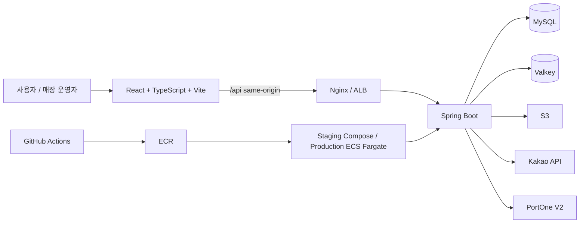
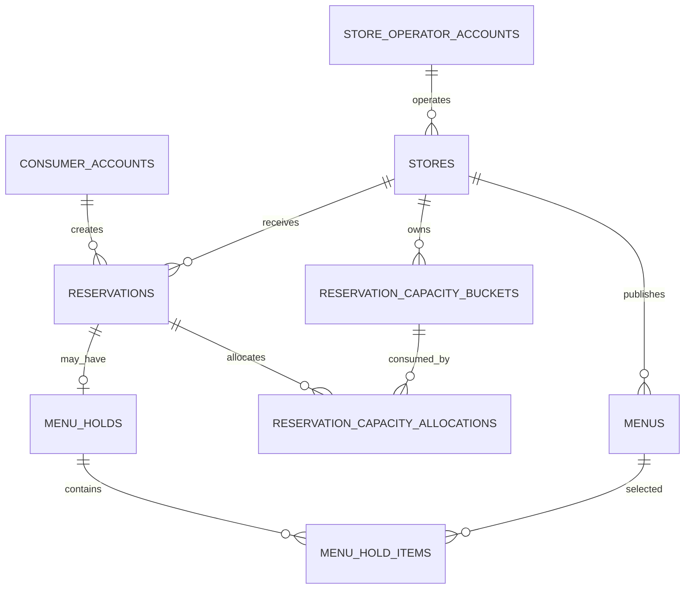
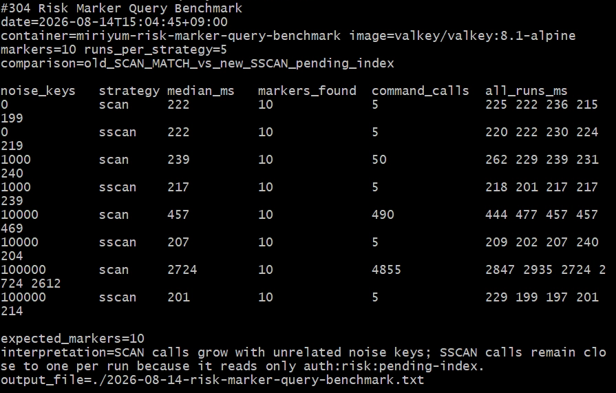

# MiriYum

> 식당 탐색부터 예약, 메뉴 홀드, 픽업, 웨이팅까지 하나의 흐름으로 연결하는 양면 다이닝 플랫폼

MiriYum은 일반 사용자가 실제로 이용 가능한 매장과 메뉴를 찾고 방문 기회를 확보하도록 돕고, 매장 운영자가 자신의 매장과 운영 방식을 관리할 수 있게 하는 서비스입니다. 기능을 빠르게 늘리기보다 계정 경계, 예약 자원, 결제와 파일 상태처럼 정확성이 필요한 흐름을 먼저 검증하는 것을 목표로 합니다.

## 핵심 기능과 사용자 흐름

| 흐름 | 사용자 경험 | 핵심 처리 |
| --- | --- | --- |
| 탐색 | 조건·카테고리·지도 기반으로 매장과 메뉴를 탐색 | 규칙 기반 조건 해석, QueryDSL 조회, Kakao 지도·지오코딩 연동 |
| 회원·인증 | 일반 로그인 또는 카카오 로그인 후 서비스 이용 | 일반 사용자·매장 운영자 계정과 JWT namespace 분리, Access 15분·Refresh 회전 |
| 예약 | 매장·시간·인원을 선택해 예약을 확정하고 내역을 확인 | 수용량 bucket, 조건부 SQL, 멱등 키로 중복·초과 예약 방지 |
| 메뉴 홀드·픽업 | 예약과 함께 메뉴를 확보하거나 픽업 예약 | 메뉴 수량 원장, 홀드 상태 전이, 취소 시 수량 복구 |
| 웨이팅·알림 | 웨이팅 현황과 상태 변경 알림 확인 | MySQL 업무 원장과 SSE·Valkey 전달 보조를 분리 |
| 매장 운영 | 매장 등록 후 운영시간·예약·메뉴·대표 이미지를 관리 | 운영자-매장 귀속 검증, 일정 version, 메뉴 version, 파일 메타데이터 관리 |
| 결제·마이페이지 | 결제·예약·알림 이력을 한 곳에서 확인 | PortOne V2 adapter, Webhook·환불·대사 원장, 공개 조회 DTO |

## 팀 역할

기능별 도메인 소유권을 분명히 두고, 공개 API와 DTO 계약으로 협업했습니다. 화면 연결, 통합 검증, 문서화와 배포는 도메인 담당자 간 공동 검토로 진행했습니다.

| 구성원 | 주요 담당 |
| --- | --- |
| `@easyhyeon3232` | 인증·인가와 계정, 마이페이지, 파일 업로드·S3, CI/CD와 AWS 배포·운영 |
| `@116Lv` | 매장, 메뉴, 운영시간, 검색·추천, 웨이팅 |
| `@usersy628` | 예약, 결제·예약금·환불, 거래 상태와 데이터 정합성 |
| `@kera9960` | Kakao 지도 연동, 메뉴 홀드·픽업·메뉴 수량, 알림, k6·성능 검증 |

## 아키텍처



- 하나의 Spring Boot 애플리케이션과 하나의 MySQL 업무 원장을 유지하며, 도메인은 공개 Service와 DTO 경계로 분리합니다.
- 일반 사용자, 매장 운영자, 플랫폼 운영자는 전용 principal, 토큰 namespace, UI 진입 경로를 사용합니다.
- staging은 same-origin Compose 배포로 사용자 흐름을 검증하고, production은 ECS Fargate, ALB, RDS, Valkey, ECR, Secrets Manager를 기준으로 구성합니다.

세부 구조와 도입 기준은 [시스템 아키텍처](docs/06-system-architecture.md)에서 확인할 수 있습니다.

## 핵심 ERD

아래는 예약 확정에 필요한 핵심 관계를 Flyway 스키마 기준으로 축약한 다이어그램입니다. 전체 물리 ERD 문서는 별도 문서 PR에서 관리합니다.



| 테이블 | 역할 |
| --- | --- |
| `consumer_accounts` | 예약을 생성하는 일반 사용자 계정 원장 |
| `store_operator_accounts` | 매장을 운영하는 운영자 계정 원장 |
| `stores` | 운영자에게 귀속되며 예약을 받고 메뉴를 게시하는 매장 |
| `menus` | 매장이 게시하고 메뉴 홀드 항목에서 선택하는 메뉴 |
| `reservations` | 일반 사용자가 생성하고 매장이 수신하는 예약 |
| `reservation_capacity_buckets` | 매장이 소유하며 예약 수용량이 배분되는 시간 단위 자원 |
| `reservation_capacity_allocations` | 예약이 생성할 때 수용량 bucket에서 소비한 할당 기록 |
| `menu_holds` / `menu_hold_items` | 예약에 선택적으로 연결되고, 선택 메뉴와 수량을 보관하는 홀드 원장 |

## 기술 스택

| 구분 | 기술 | 사용 목적 |
| --- | --- | ---|
| Frontend | React 19, TypeScript, Vite, React Router, TanStack Query, Vitest | 사용자·운영자 화면, API 상태 관리, OpenAPI 생성 타입, 화면 테스트 |
| Backend | Java 21, Spring Boot, Spring MVC, Spring Security, Spring Data JPA, QueryDSL | 인증·인가, 도메인 서비스, API, 조건 조회와 트랜잭션 경계 |
| Data | MySQL, Flyway, Valkey, Testcontainers | 업무 원장·스키마 이력, 토큰 회전·SSE 전달 보조, 실제 DB 통합 테스트 |
| External | Kakao OAuth/Local/Map, PortOne V2, Amazon S3 | 소셜 로그인·지도, 결제·Webhook, 이미지와 증빙 객체 저장 |
| Deploy | Docker Compose, Nginx, GitHub Actions, AWS ECR, ECS Fargate, ALB, RDS, ElastiCache, CloudWatch, Route 53, ACM | same-origin staging, 운영 컨테이너 배포, 관측·도메인·TLS |

## 주요 기술 결정

### 인증과 세션 보안

- Access Token은 15분짜리 stateless JWT로 검증하고, Refresh Token은 Valkey에서 회전, 폐기, 재사용 탐지를 관리합니다.
- 폐기된 Refresh Token의 재사용이 감지되면 동일 token family를 차단하고 위험 사건을 기록합니다.
- 쿠키 기반 인증은 `SameSite`, Origin 검증, CSRF 토큰 대조를 함께 적용합니다.

### 데이터 정확성과 장애 대응

- 예약과 메뉴 홀드처럼 경합이 큰 쓰기는 MySQL 제약, 조건부 SQL, 고정 잠금 순서, 멱등 키로 보호합니다.
- Refresh Token 재사용 위험 사건은 Valkey의 원자 처리와 pending marker를 사용해 MySQL 전달 장애 중에도 유실되지 않도록 설계했습니다.
- S3 객체 상태는 MySQL 파일 메타데이터와 분리해 관리하고, 부분 실패와 고아 객체를 재처리할 수 있도록 확장합니다.

### 성능과 관측성

- 위험 사건 전달 조회를 전체 keyspace `SCAN`에서 pending 인덱스 조회로 전환했습니다.
- 로컬 Valkey 마이크로 벤치마크에서 marker 10개, 관계없는 키 10만 개 조건의 중앙값은 `2,724ms -> 201ms`, 조회 명령은 `4,855회 -> 5회`였습니다.
- 이 수치는 API 응답 시간이나 운영 처리량이 아니라 저장소 조회 단계만 분리한 측정값입니다. 관계없는 키가 없는 조건에서는 두 방식 모두 `222ms`로 차이가 없었습니다.

#### 위험 사건 marker 조회 벤치마크

기존 방식은 `SCAN MATCH`로 전체 keyspace를 훑고, 변경 방식은 pending marker만 담은 Set을 `SSCAN`으로 읽습니다. marker는 10개로 고정하고 관계없는 키만 늘렸으며, 각 조건에서 5회 실행한 중앙값입니다.

| 관계없는 키 | 기존 `SCAN` 중앙값 | pending 인덱스 `SSCAN` 중앙값 | 찾은 marker | 조회 명령 호출 |
| ---: | ---: | ---: | ---: | ---: |
| 0 | 222ms | 222ms | 10 | 5회 / 5회 |
| 1,000 | 239ms | 217ms | 10 | 50회 / 5회 |
| 10,000 | 457ms | 207ms | 10 | 490회 / 5회 |
| 100,000 | 2,724ms | 201ms | 10 | 4,855회 / 5회 |

관계없는 키 10만 개 조건에서 조회 시간은 약 92.6%, 조회 명령 호출은 약 99.9% 줄었습니다. 두 방식 모두 marker 10개를 빠짐없이 찾았고, 키가 적은 조건에서는 인덱스 방식이 항상 더 빠르다는 식의 과장을 하지 않습니다.



## 프로젝트 구조

```text
.
├── backend/                 # Spring Boot API, 도메인, Flyway migration, backend test
├── frontend/                # React 화면, OpenAPI 생성 타입, frontend test
├── deploy/                  # local Compose, staging CD, Nginx와 운영 배포 구성
├── infra/terraform/         # 승인된 운영 인프라의 시작·종료 보조 스크립트
├── docs/
│   ├── specs/               # 기능별 OpenAPI와 인수 조건
│   ├── service-policies/    # 서비스 정책 정본
│   ├── adr/                 # 아키텍처 결정 기록
│   └── deployment/          # 배포·관측·장애 대응 런북
└── scripts/                 # 검증, 관측, 성능 측정 스크립트
```

## 로컬 실행

### 사전 요구사항

- Docker Desktop
- Node.js 24 이상과 pnpm 11

### Backend와 MySQL 실행

```bash
cd deploy/local
cp .env.example .env
docker compose -f docker-compose.dev.yml up -d --build
docker compose -f docker-compose.dev.yml ps
curl http://127.0.0.1:8080/api/v1/store-categories
```

### Frontend 실행

```bash
cd frontend
pnpm install
pnpm run dev
```

브라우저에서 `http://localhost:5173`으로 접속합니다. Vite dev server는 `/api` 요청을 로컬 backend로 프록시합니다. 포트를 바꾸면 `deploy/local/.env`의 `MIRIYUM_ALLOWED_ORIGIN`도 같은 origin으로 맞춰야 합니다.

로컬 환경 변수, 중지 방법, SSE 부하 테스트 프로필과 문제 해결은 [로컬 개발 실행 환경](deploy/local/README.md)을 기준으로 합니다.

## 핵심 API 명세

기능별 OpenAPI는 [docs/specs](docs/specs/)에서 관리하고, frontend는 해당 명세로 생성한 TypeScript 타입을 사용합니다.

| 영역 | 대표 endpoint | 계약 목적 |
| --- | --- | --- |
| 인증 | `POST /api/v1/consumers/auth/sessions`<br>`POST /api/v1/consumers/auth/token-refreshes` | 일반 사용자 로그인과 Refresh Token 회전 |
| 매장 탐색 | `GET /api/v1/stores`<br>`GET /api/v1/stores/{storeId}/menus` | 공개 매장·메뉴 목록, 검색 조건과 노출 정보 조회 |
| 예약 | `POST /api/v1/consumers/me/reservations`<br>`POST /api/v1/consumers/me/reservation-requests/{reservationRequestId}/finalizations` | 예약을 생성하고, 예약금이 필요한 경우 생성 응답의 request를 결제 확인 뒤 최종 확정 |
| 매장 운영 | `POST /api/v1/store-operators/stores`<br>`POST /api/v1/store-operators/stores/{storeId}/menus` | 운영자 본인 매장 등록과 메뉴 관리 |
| 웨이팅 | `GET /api/v1/store-operators/stores/{storeId}/waiting-teams`<br>`POST /api/v1/store-operators/stores/{storeId}/waiting-teams/{waitingTeamId}/calls` | 매장 운영자의 웨이팅 대기열 조회와 호출 상태 전이 |

## 문서

- [프로젝트 지식 색인](docs/00-index.md)
- [제품 비전](docs/01-product-vision.md)
- [시스템 아키텍처](docs/06-system-architecture.md)
- [서비스 정책](docs/service-policies/README.md)
- [아키텍처 결정 기록](docs/adr/)
- [기능별 OpenAPI와 인수 조건](docs/specs/)
- [배포 및 운영 런북](docs/deployment/)
- [기여 가이드](CONTRIBUTING.md)

## 문서 기준

README는 프로젝트 소개와 시작 경로만 제공합니다. 제품 정책, 권한, 상태 전이, 배포 절차와 기능 계약의 기준은 [프로젝트 지식 색인](docs/00-index.md)에 연결된 정본 문서입니다.
