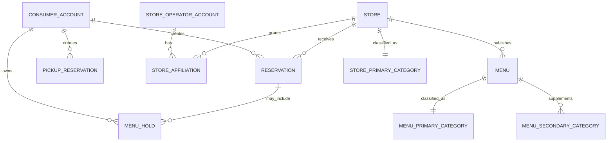

# 03. 도메인 관계 모델

## 목적과 경계

이 문서는 계정, 매장, 예약, 메뉴 홀드, 픽업과 카테고리 사이의 제품 관계를 설명한다. 패키지·모듈·배포 단위, 데이터베이스 제품이나 아키텍처 선택은 소유하지 않는다. 상세 상태·예외·전이는 연결된 서비스 정책이 소유한다.

## 계정과 매장 관계

일반 사용자 계정, 매장 운영자 계정과 플랫폼 운영자 계정은 물리적으로 분리된 세 계정 유형이다. 서로 다른 기본 키·인증 주체·토큰 네임스페이스를 가지며 이메일·휴대전화·외부 로그인 정보가 같아도 계정 유형과 권한을 합치지 않는다.

관계의 기준은 다음과 같다.

- 일반 사용자 계정은 자신이 생성한 예약, 메뉴 홀드와 픽업 예약의 소유자다.
- 매장 운영자 계정은 `매장 운영자-매장 소속` 관계를 통해 하나 이상의 매장과 연결될 수 있다.
- 매장 관리 권한은 매장 운영자 계정 자체가 아니라 유효한 계정 상태, 유효한 소속 관계와 대상 매장 상태를 함께 충족할 때 성립한다.
- 플랫폼 운영자 계정은 매장 소속이 아니라 별도로 부여된 플랫폼 업무 권한으로 심사·지원·복구를 수행한다.

## 매장과 메뉴 카테고리

카테고리는 검색 의미를 하나로 유지한다.

- 매장은 주 카테고리를 정확히 1개 가진다. 매장 보조 카테고리는 두지 않는다.
- 메뉴는 주 카테고리를 필수로 정확히 1개 가진다.
- 메뉴는 서로 중복되지 않고 주 카테고리와도 중복되지 않는 보조 카테고리를 0개부터 5개까지 가질 수 있다.
- 신청자가 구조화 입력한 주업태명·주종목명, 공식 진위확인으로 검증된 주업태명·주종목명, 검색 태그와 카테고리는 서로 다른 개념이며 자동으로 같은 값으로 취급하지 않는다. `고도화`에서 사업자등록증 이미지를 받더라도 파일에서 카테고리를 자동 추출하지 않는다.

## 픽업 업종 자격

- `store`는 공식 진위확인으로 검증된 주업태명·주종목명, 국세청 공식 응답 계약 버전과 적용한 허용 매핑 버전을 근거로 매장별 중앙 `카페·베이커리 자격 확인` 상태를 소유한다.
- 허용 매핑의 정확한 문자열·조합은 책임자, 평가 데이터셋, 공식 응답 계약과 매핑 버전·효력 시점을 정해 `1차 MVP` 첫 픽업 예약 전에 확정하며 예시값을 추측하지 않는다.
- 공식 업종 검증 불가·신청값 불일치·유효한 매핑 없음에는 픽업 자격만 부여하지 않는다. 일반 입점 상태와 `예약만`·`예약+메뉴 홀드` 자격은 이 상태와 별도다.
- `booking`은 픽업 활성화와 확정 시 중앙 자격 상태를 소비할 뿐 업종 자기 입력·검색 카테고리·태그에서 자격을 추론하거나 생성하지 않는다.

## 예약 자원

예약은 개별 테이블·좌석이 아니라 매장 날짜와 시간 구간별 집계 자원을 사용한다.

- `전체 예약 가능 인원`: 해당 날짜·시간 구간에서 플랫폼 예약으로 받을 수 있는 사람 수
- `전체 예약 가능 팀 수`: 해당 날짜·시간 구간에서 플랫폼 예약으로 받을 수 있는 예약 건수

예약 요청은 점유하는 모든 날짜·시간 구간에서 요청 인원과 팀 1건을 함께 확보해야 한다. 두 자원 가운데 하나라도 부족하면 확정하지 않는다. 개별 테이블 번호, 좌석 위치나 테이블 조합을 예약 자원으로 해석하지 않는다.

## 매장 운영 모드와 거래 관계

다음 세 항목은 상호 배타적인 매장 유형이 아니라 거래별 운영 모드·활성 기능이다. 매장은 입점·기능 조건에 맞는 항목을 함께 활성화할 수 있고, 중앙의 `카페·베이커리 자격 확인` 상태를 얻은 정상 매장은 `1차 MVP`부터 `픽업 예약`을 `예약만` 또는 `예약+메뉴 홀드`와 병행할 수 있다.

| 운영 모드 | 생성하는 거래와 자원 |
|---|---|
| `예약만` | 예약이 날짜·시간 구간별 인원과 팀 수를 점유한다. |
| `예약+메뉴 홀드` | 하나의 예약 거래가 예약 인원·팀 수와 선택 메뉴 수량을 함께 선점하고 전부 확정하거나 전부 반환한다. |
| `픽업 예약` | 공식 검증된 주업태명·주종목명과 버전된 허용 매핑으로 중앙의 `카페·베이커리 자격 확인` 상태를 얻은 매장만 사용한다. 픽업 제공 구간과 메뉴 수량을 점유하며 예약 인원·팀 수는 만들지 않는다. |

운영 모드 변경은 변경 이후의 신규 거래에 적용한다. 모드가 비활성화되거나 다른 모드로 바뀌어도 기존 확정 예약, 메뉴 홀드와 픽업 예약은 거래 당시 모드·정책·가격·자원 스냅샷을 유지하고 자동 취소·전환하지 않는다.

## 정책 연결

- 계정 유형과 인증 경계: [회원·인증·계정 정책](service-policies/01-member-auth.md)
- 매장 운영자-매장 소속: [매장 입점·심사·매장 운영자 권한 정책](service-policies/02-store-onboarding.md)
- 카테고리와 운영 모드: [매장 운영·영업시간·메뉴 정책](service-policies/03-store-operation.md)
- 예약 인원·팀 수 자원: [예약 정책](service-policies/04-reservation.md)
- 예약 결합 메뉴 홀드와 픽업 예약: [메뉴 홀드 정책](service-policies/06-menu-hold.md)
