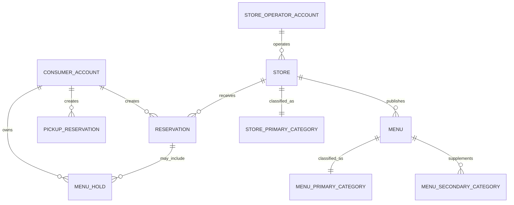

# 03. 도메인 관계 모델

## 목적과 경계

이 문서는 계정, 매장, 예약, 메뉴 홀드, 픽업과 카테고리 사이의 제품 관계를 설명한다. 패키지·모듈·배포 단위, 데이터베이스 제품이나 아키텍처 선택은 소유하지 않는다. 상세 상태·예외·전이는 연결된 서비스 정책이 소유한다.

Flyway 기준 전체 물리 테이블 색인과 주요 관계는 [전체 스키마 색인과 주요 관계 ERD](erd/README.md)에서 확인한다. DB FK·UNIQUE·CHECK는 각 migration이 최종 기준이며, 이 문서는 제품 관계와 핵심 논리 관계만 다룬다.

## 계정과 매장 관계

최종 계정 모델은 일반 사용자·매장 운영자·플랫폼 운영자를 물리적으로 분리한다. 1차 MVP에는 일반 사용자와 매장 운영자만 구현하고, 플랫폼 운영자 계정·JWT·API·UI는 고도화에서 추가한다. 활성화된 유형은 서로 다른 기본 키·인증 주체·토큰 네임스페이스를 가지며 이메일·휴대전화·외부 로그인 정보가 같아도 계정 유형과 권한을 합치지 않는다.

관계의 기준은 다음과 같다.

- 일반 사용자 계정은 자신이 생성한 예약, 메뉴 홀드와 픽업 예약의 소유자다.
- 1차 MVP의 매장은 `store_operator_account_id`로 대표 운영자 계정 하나를 직접 참조하며, 한 운영자 계정은 여러 매장에서 참조될 수 있다.
- 매장 관리의 공통 권한은 유효한 운영자 계정과 대상 매장의 대표 운영자 FK 일치로 성립한다. 현재 매장 상태 적격성은 명령별 계약이 판단하며, 예약 취소·방문 완료 같은 기존 확정 거래 종결은 CLOSED·휴점에서도 허용할 수 있다.
- 플랫폼 운영자 계정은 매장 소속이 아니라 별도로 부여된 플랫폼 업무 권한으로 심사·지원·복구를 수행한다.

## 매장과 메뉴 카테고리

카테고리는 검색 의미를 하나로 유지한다.

- 매장은 주 카테고리를 정확히 1개 가진다. 매장 보조 카테고리는 두지 않는다.
- 메뉴는 주 카테고리를 필수로 정확히 1개 가진다.
- 메뉴는 서로 중복되지 않고 주 카테고리와도 중복되지 않는 보조 카테고리를 0개부터 5개까지 가질 수 있다.
- 사업자등록증의 업태·종목과 검색 태그·카테고리는 서로 다른 개념이며 자동으로 같은 값으로 취급하지 않는다. 공식 진위확인과 사업자등록증 증빙을 사용하더라도 파일에서 검색 카테고리를 자동 추출하지 않는다.

## 픽업 기능 자격

- 모든 승인 매장은 업종과 무관하게 `pickupEnabled`로 픽업 예약 기능을 선택할 수 있다.
- 과거 업종 기반 픽업 판정에 사용한 `businessType(CAFE/BAKERY/OTHER)`은 도메인 의미와 화면에서 제거한다. rolling 전환 동안에만 Store와 신청 snapshot에 비-null 호환값을 유지하고 후속 contract에서 제거한다.
- `pickup`은 픽업 확정 시 Store 공개 계약으로 승인·영업·`pickupEnabled` 상태를 검증하고 사업자등록증 업태·종목, 검색 카테고리·태그를 판정에 사용하지 않는다.

## 예약 자원

예약은 개별 테이블·좌석이 아니라 매장 날짜와 시간 구간별 집계 자원을 사용한다.

- `전체 예약 가능 인원`: 해당 날짜·시간 구간에서 플랫폼 예약으로 받을 수 있는 사람 수
- `전체 예약 가능 팀 수`: 해당 날짜·시간 구간에서 플랫폼 예약으로 받을 수 있는 예약 건수

예약 요청은 점유하는 모든 날짜·시간 구간에서 요청 인원과 팀 1건을 함께 확보해야 한다. 두 자원 가운데 하나라도 부족하면 확정하지 않는다. 개별 테이블 번호, 좌석 위치나 테이블 조합을 예약 자원으로 해석하지 않는다.

## 매장 운영 모드와 거래 관계

다음 세 항목은 상호 배타적인 매장 유형이 아니라 거래별 운영 모드·활성 기능이다. 정상 매장은 사업자등록증 업태·종목과 무관하게 `1차 MVP`부터 `픽업 예약`을 `예약만` 또는 `예약+메뉴 홀드`와 병행할 수 있다.

| 운영 모드 | 생성하는 거래와 자원 |
|---|---|
| `예약만` | 예약이 날짜·시간 구간별 인원과 팀 수를 점유한다. |
| `예약+메뉴 홀드` | 하나의 예약 거래가 예약 인원·팀 수와 선택 메뉴 수량을 함께 선점하고 전부 확정하거나 전부 반환한다. |
| `픽업 예약` | 사업자등록증 업태·종목과 무관하게 `pickupEnabled`인 매장이 사용한다. 픽업 제공 구간과 메뉴 수량을 점유하며 예약 인원·팀 수는 만들지 않는다. |

운영 모드 변경은 변경 이후의 신규 거래에 적용한다. 모드가 비활성화되거나 다른 모드로 바뀌어도 기존 확정 예약, 메뉴 홀드와 픽업 예약은 거래 당시 모드·정책·가격·자원 스냅샷을 유지하고 자동 취소·전환하지 않는다.

## 정책 연결

- 계정 유형과 인증 경계: [회원·인증·계정 정책](service-policies/01-member-auth.md)
- 매장 운영자-매장 소속: [매장 입점·심사·매장 운영자 권한 정책](service-policies/02-store-onboarding.md)
- 카테고리와 운영 모드: [매장 운영·영업시간·메뉴 정책](service-policies/03-store-operation.md)
- 예약 인원·팀 수 자원: [예약 정책](service-policies/04-reservation.md)
- 예약 결합 메뉴 홀드와 픽업 예약: [메뉴 홀드 정책](service-policies/06-menu-hold.md)
