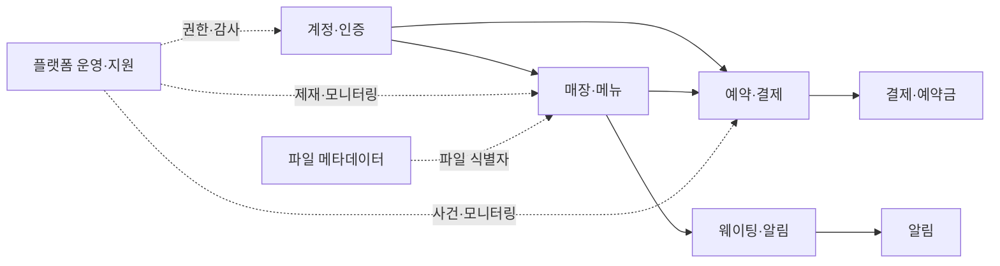

# 전체 물리 ERD

## 기준과 읽는 법

이 문서는 현재 `dev`의 Flyway V1~V66을 기준으로 작성한 MySQL 물리 ERD다. 너무 큰 단일 다이어그램 대신 도메인별로 나눠 검토한다. 각 문서의 테이블 색인을 합치면 V1~V66에서 생성한 모든 테이블을 찾을 수 있다.

- 실선 관계는 DB `FOREIGN KEY`다.
- `logical` 표기는 애플리케이션이 식별자만 보관하는 논리 참조다. DB FK가 있다는 뜻이 아니다.
- 객체 키, URL, 토큰, 사업자등록번호, 대표자명 같은 민감값은 표시하지 않는다.
- V67 사업자등록증 증빙 원장은 아직 `dev`에 병합되지 않았으며, #489의 [증빙 ERD](../specs/store-onboarding/erd.md)에서 별도로 관리한다.

## 도메인별 ERD

| 영역 | 문서 | 주요 테이블 |
| --- | --- | --- |
| 계정·인증·파일 | [Auth / Storage](auth-storage.md) | 계정, 소셜 연결, 요청 제한, 멱등 명령, 파일 메타데이터 |
| 매장·메뉴 | [Store / Catalog](store-catalog.md) | 매장, 일정, 메뉴 version, 재고, 제재 |
| 예약·결제 | [Reservation / Payment](reservation-payment.md) | 예약, 홀드, 픽업, 예약금, 결제·복구 |
| 웨이팅·알림 | [Waiting / Notification](waiting-notification.md) | 웨이팅 팀·원장·설정, 알림 task |
| 플랫폼 운영·지원 | [Platform / Support](platform-support.md) | 운영자 권한, 사건 배정, 제재, 회원 지원, 분석 snapshot |

## 전체 관계 개요

## 검증 방법

1. `backend/src/main/resources/db/migration`의 `CREATE TABLE` 목록과 각 문서의 색인을 대조한다.
2. 관계 해석이 필요하면 해당 Flyway 파일의 FK/UNIQUE/CHECK 제약을 최종 기준으로 삼는다.
3. 향후 migration이 새 테이블을 만들면 같은 PR에서 해당 도메인 ERD와 이 문서의 색인을 함께 갱신한다.
