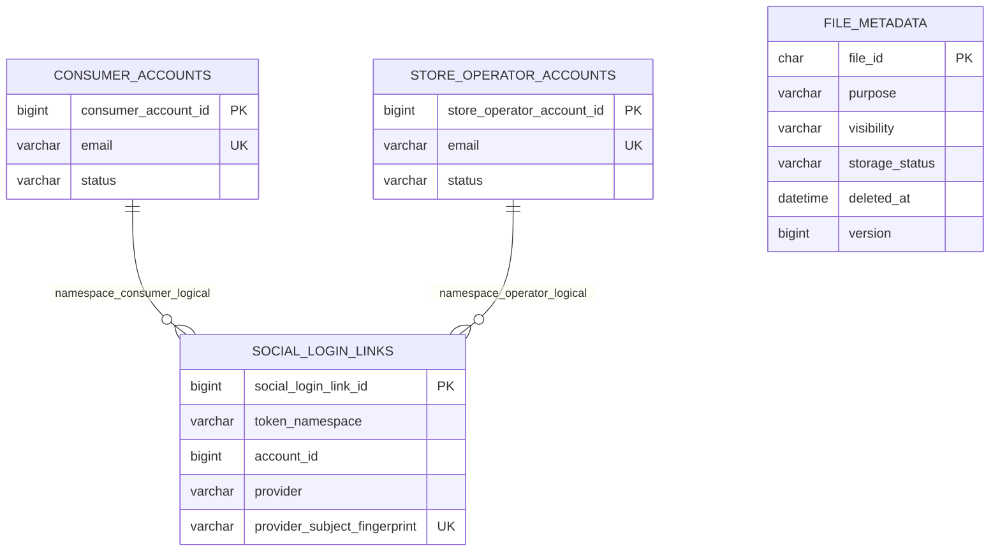

# Auth / Storage 물리 ERD

`social_login_links.account_id`는 namespace에 따라 일반 사용자 또는 매장 운영자 계정을 가리키는 다형 논리 참조다. DB FK가 아니므로 두 계정 테이블을 직접 결합하지 않는다.

## 테이블 색인

| Migration | 테이블 | 역할 |
| --- | --- | --- |
| V1 | `consumer_accounts` | 일반 사용자 계정 원장 |
| V4 | `idempotency_commands` | HTTP 명령 멱등 결과 원장 |
| V5 | `rate_limit_windows` | 요청 제한 window 원장 |
| V6 | `store_operator_accounts` | 매장 운영자 계정 원장 |
| V14 | `login_failure_delays` | 로그인 실패 지연 상태 |
| V32 | `file_metadata` | 공통 파일 메타데이터와 정리 상태 |
| V34 | `auth_risk_events` | Refresh 재사용 위험 사건 원장 |
| V37 | `social_login_links` | 카카오 등 소셜 provider fingerprint 연결 |

Refresh family·세션 상태는 Valkey가 소유하며 MySQL 테이블로 표현하지 않는다.
