# Platform / Support 주요 관계 ERD

```mermaid
erDiagram
    PLATFORM_OPERATOR_ACCOUNTS ||--o{ PLATFORM_OPERATOR_AUTH_EVENTS : authenticates
    PLATFORM_OPERATOR_ACCOUNTS ||--o{ PLATFORM_OPERATOR_ROLE_GRANTS : receives
    PLATFORM_OPERATOR_ACCOUNTS ||--o{ PLATFORM_OPERATOR_PERMISSION_GRANTS : receives
    PLATFORM_OPERATOR_ACCOUNTS ||--o{ PLATFORM_OPERATOR_REAUTHENTICATION_APPROVALS : reauthenticates
    PLATFORM_OPERATOR_ACCOUNTS ||--o{ PLATFORM_OPERATOR_AUDIT_EVENTS : acts
    PLATFORM_OPERATOR_ACCOUNTS ||--o{ ADMIN_CASE_ASSIGNMENTS : assigned
    MEMBER_SUPPORT_CASES ||--o{ MEMBER_SANCTIONS : manages
    MEMBER_SANCTIONS ||--o{ MEMBER_SANCTION_APPROVALS : approves
    MEMBER_SUPPORT_CASES ||--o{ MEMBER_SUPPORT_AUDITS : case_id_logical
    STORE_SANCTION_CASES ||--o{ STORE_SANCTIONS : decides
    STORE_SANCTIONS ||--o{ STORE_SANCTION_APPROVALS : approves
    PAYMENT_RECOVERY_CASES ||--o{ PAYMENT_RECOVERY_PROPOSALS : proposes
    PAYMENT_RECOVERY_PROPOSALS ||--o{ PAYMENT_RECOVERY_APPROVALS : approves
    PAYMENT_RECOVERY_CASES ||--o{ PAYMENT_RECOVERY_EXECUTIONS : executes
```

## 테이블 색인

| Migration | 테이블 |
| --- | --- |
| V39 | `platform_operator_accounts`, `platform_operator_auth_events` |
| V40 | `platform_operator_role_grants`, `platform_operator_permission_grants`, `admin_case_assignments`, `platform_operator_reauthentication_approvals`, `platform_operator_authority_guard` |
| V43 | `platform_operator_audit_events` |
| V46 | `member_identity_verifications`, `member_support_cases`, `member_sanctions`, `member_sanction_approvals`, `member_support_audits` |
| V53 | `store_enforcement_states`, `store_sanction_cases`, `store_sanction_impact_previews`, `store_sanctions`, `store_sanction_approvals` |
| V57 | `dashboard_analytics_snapshots`, `dashboard_analytics_metric_snapshots` |
| V66 | `payment_recovery_cases`, `payment_recovery_proposals`, `payment_recovery_approvals`, `payment_recovery_executions` |

운영자 권한과 사건 배정은 플랫폼 운영자 도메인이 소유한다. 회원·매장·결제의 실체 데이터는 공개 조회 계약으로 조합하며, 운영 ERD에서 다른 도메인 테이블을 직접 수정하는 관계로 해석하지 않는다.
