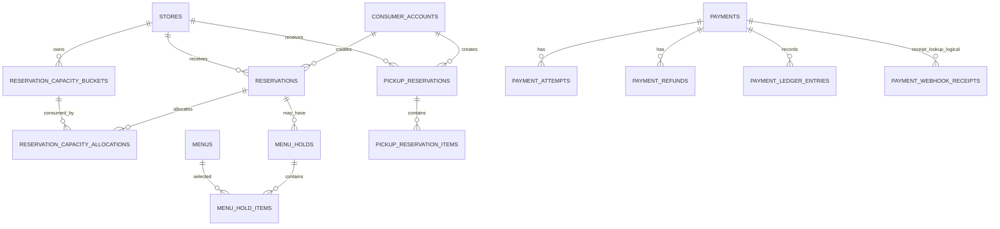

# Reservation / Payment 주요 관계 ERD

## 테이블 색인

| Migration | 테이블 |
| --- | --- |
| V15, V24, V26, V28 | `reservations`, `reservation_capacity_buckets`, `reservation_capacity_allocations`, `reservation_cancellation_audits`, `reservation_fulfillment_audits` |
| V21, V64 | `menu_holds`, `menu_hold_items`, `menu_hold_transition_audits` |
| V27 | `pickup_reservations`, `pickup_reservation_items` |
| V30 | `payment_public_ids`, `refund_public_ids`, `payments`, `payment_attempts`, `payment_refunds`, `payment_ledger_entries`, `payment_webhook_receipts` |
| V31 | `reservation_holds`, `reservation_hold_capacity_allocations`, `reservation_hold_transition_audits`, `reservation_hold_warning_tasks` |
| V49 | `reservation_check_in_qr_grants`, `reservation_check_in_audits`, `reservation_no_show_audits` |
| V55, V58, V59 | `reservation_deposit_processes`, `reservation_deposit_calculation_items`, `reservation_deposit_cause_audits`, `reservation_deposit_refund_obligations`, `reservation_deposit_dispositions`, `reservation_deposit_disposition_obligations` |
| V62, V65, V66 | `payment_recovery_handoffs`, `reservation_payment_recovery_outbox`, `payment_monitoring_snapshots`, `payment_refund_monitoring_snapshots`, `payment_recovery_cases`, `payment_recovery_proposals`, `payment_recovery_approvals`, `payment_recovery_executions` |

결제·예약금·복구 테이블은 공개 ID 또는 업무 식별자 기반 논리 참조를 포함한다. 다형 거래를 물리 FK로 단정하지 않는다.
