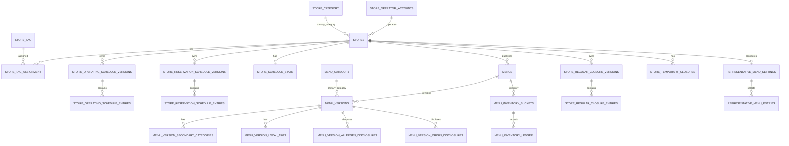

# Store / Catalog 주요 관계 ERD

## 테이블 색인

| Migration | 테이블 |
| --- | --- |
| V2 | `store_category`, `menu_category`, `store_tag` |
| V8 | `stores`, `store_tag_assignment` |
| V9, V12, V13 | `store_operating_schedule_versions`, `store_operating_schedule_entries`, `store_reservation_schedule_versions`, `store_reservation_schedule_entries`, `store_schedule_state`, `store_schedule_audit_events` |
| V16 | `menus`, `menu_versions`, `menu_version_secondary_categories`, `menu_version_local_tags`, `menu_version_allergen_disclosures`, `menu_version_origin_disclosures`, `menu_publication_events` |
| V17, V19 | `menu_inventory_buckets`, `menu_inventory_ledger`, `menu_inventory_policy_audits` |
| V18 | `store_regular_closure_versions`, `store_regular_closure_entries`, `store_temporary_closures`, `store_closure_audit_events` |
| V20 | `reservation_time_policy_versions`, `reservation_time_policy_audits` |
| V35 | `representative_menu_settings`, `representative_menu_entries`, `representative_menu_audits` |
| V41 | `store_reservation_deposit_policies` |
| V53 | `store_enforcement_states`, `store_sanction_cases`, `store_sanction_impact_previews`, `store_sanctions`, `store_sanction_approvals` |
| V67 | `store_business_registration_evidences` |

일정·재고·대표 메뉴·제재 감사는 대상 매장 또는 업무 ID를 보관하는 원장이다. 사업자등록증 증빙은 파일 메타데이터의 `file_id`를 물리 FK로 참조하고, 신청·버전과 운영자 식별자는 업무 경계에서 검증한다. 상세 FK와 상태 제약은 해당 migration을 우선한다.
