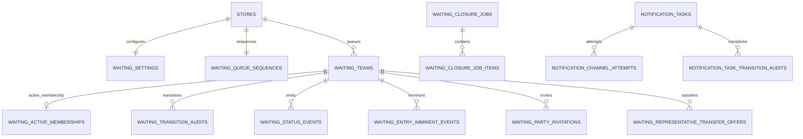

# Waiting / Notification 물리 ERD

## 테이블 색인

| Migration | 테이블 |
| --- | --- |
| V33 | `notification_tasks`, `notification_channel_attempts`, `notification_task_transition_audits` |
| V36 | `waiting_queue_sequences`, `waiting_teams`, `waiting_active_memberships`, `waiting_transition_audits`, `waiting_closure_jobs`, `waiting_closure_job_items`, `waiting_status_events` |
| V45 | `waiting_conversion_compensations` |
| V47 | `waiting_settings`, `waiting_setting_audits` |
| V51 | `waiting_auto_open_jobs`, `waiting_reception_windows` |
| V54 | `waiting_entry_imminent_events` |
| V61 | `waiting_location_proof_sessions`, `waiting_party_invitations`, `waiting_representative_transfer_offers`, `waiting_party_audits` |

알림 수신자, SSE 연결, 위치 증명·초대 토큰은 보안상 업무 식별자나 fingerprint를 사용한다. 계정·매장 FK가 없는 경우에도 해당 도메인의 공개 Service로 소유권을 검증한다.
