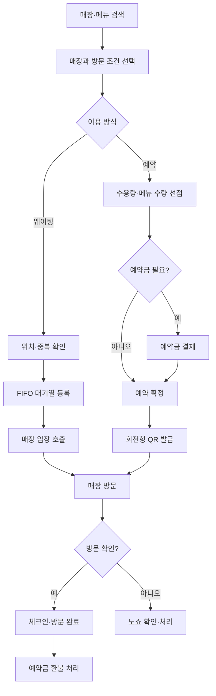
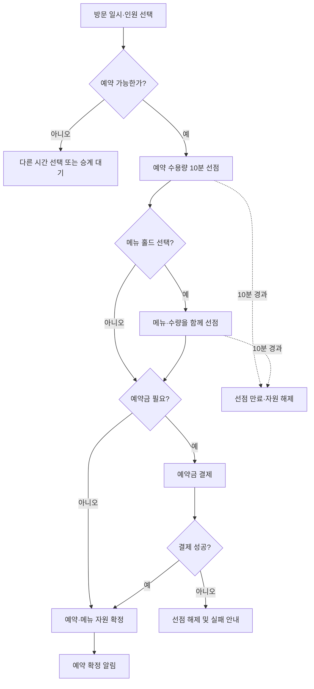
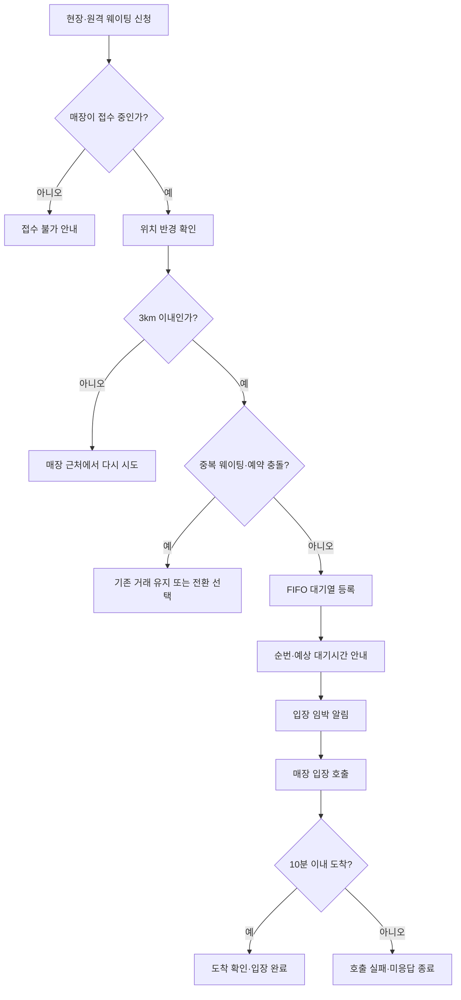
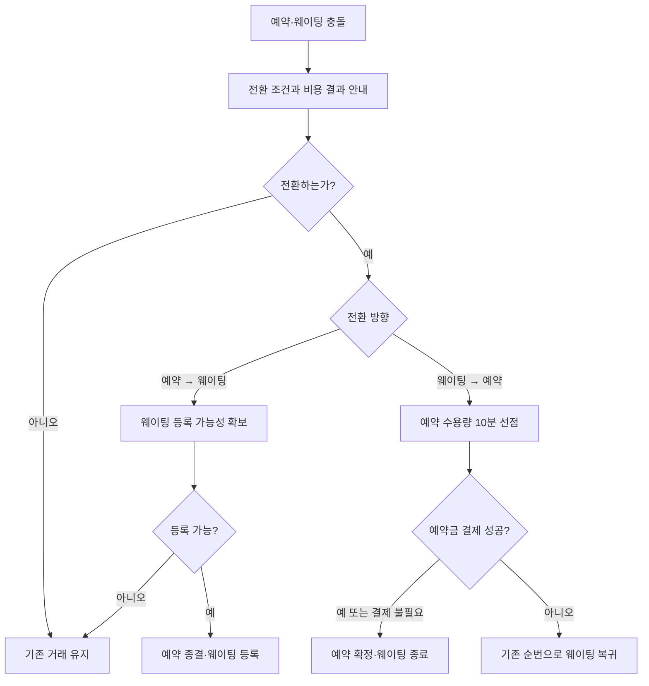
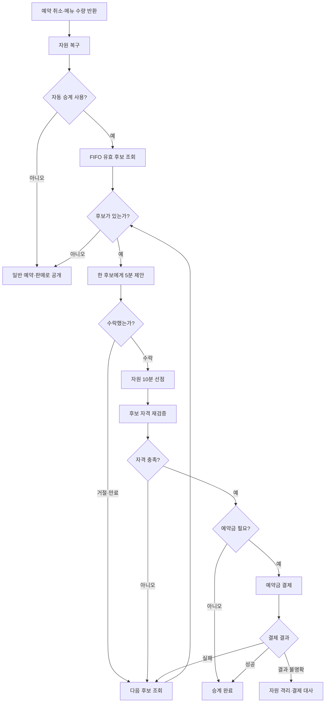
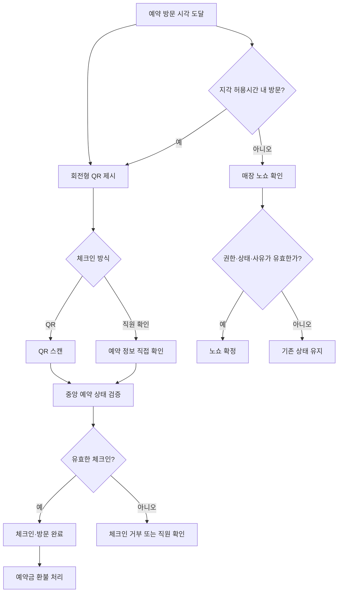

# MiriYum 비즈니스 플로우

> 기준 문서: [제품 비전](../01-product-vision.md), [서비스 정책](../service-policies/README.md)
>
> 작성 기준일: 2026-07-23
>
> 다이어그램 형식: GitHub Markdown Mermaid

---

## 개요

### 목적

MiriYum의 핵심 사용자 여정을 플로우차트 중심으로 정리한다. 발표에서 전체 흐름을 빠르게 설명할 수 있도록 정상 흐름과 핵심 실패 분기만 다이어그램에 표시하고, 세부 동시성·복구 규칙은 각 기능의 예외 흐름과 공통 비즈니스 규칙에서 설명한다.

### 범위

이 문서는 다음 비즈니스 흐름을 다룬다.

- 매장·메뉴 탐색부터 예약, 메뉴 홀드, 예약금 결제까지의 통합 예약
- 현장·원격 웨이팅 등록과 입장
- 예약과 웨이팅의 상호 전환
- 취소 자리와 반환 메뉴 수량의 자동 승계
- 회전형 QR·권한 있는 매장 운영자 확인을 통한 체크인과 직접 노쇼 처리

코스·테이스팅, 사용자 구독, 매장 Pro, 광고, POS 실시간 전체 재고 연동은 현재 문서의 범위에서 제외한다.

### 의존성

- 서비스 범위: [제품 비전](../01-product-vision.md)
- 참여자와 권한: [사용자와 권한](../02-users-and-permissions.md)
- 예약 정책: [방문 예약](../service-policies/04-reservation.md)
- 웨이팅 정책: [현장·원격 웨이팅](../service-policies/05-waiting.md)
- 메뉴 수량 정책: [메뉴 홀드](../service-policies/06-menu-hold.md)
- 결제 정책: [결제·환불·정산](../service-policies/08-payment-refund.md)
- 방문 판정 정책: [체크인·노쇼](../service-policies/09-checkin-noshow.md)
- 반환 자원 정책: [취소 자리·수량 자동 승계](../service-policies/10-waitlist-transfer.md)

---

## 흐름 목록

| 흐름 | 주요 참여자 | 핵심 상태·자원 | 기본 다이어그램 |
|---|---|---|---|
| 전체 사용자 여정 | 사용자, 매장 | 예약, 메뉴 수량, 예약금, 방문 상태 | 플로우차트 |
| 통합 예약 | 사용자, 매장, 결제사 | 수용량 선점, 메뉴 선점, 결제 | 플로우차트 |
| 현장·원격 웨이팅 | 사용자, 매장 | 대기 순번, 호출, 도착 | 플로우차트 |
| 예약·웨이팅 전환 | 사용자, 매장 | 기존 거래, 전환 선점 | 플로우차트 |
| 취소 자원 자동 승계 | 사용자, 매장 | 반환 자원, 승계 제안 | 플로우차트 |
| QR 체크인·노쇼 | 사용자, 매장 | 체크인, 방문 완료, 노쇼 | 플로우차트 |

---

## 1. 전체 사용자 여정

### 목적

사용자가 매장과 메뉴를 탐색한 뒤 예약 또는 웨이팅을 이용하고, 현장 방문과 체크인까지 완료하는 전체 서비스 흐름을 보여준다.

### 참여 주체

- 일반 사용자
- 식당 대표자 또는 권한 있는 매장 운영자
- MiriYum
- 외부 결제사

### 선행 조건

- 공개된 매장과 메뉴는 비회원도 조회할 수 있다.
- 예약, 웨이팅, 메뉴 홀드, 결제는 로그인한 일반 사용자만 이용한다.
- 매장이 해당 기능을 활성화했고 영업 가능한 상태여야 한다.
- 회전형 QR 체크인은 1차 MVP에 포함하며 권한 있는 매장 운영자의 직접 확인을 보조 경로로 제공한다. 일회 확인번호는 후속 구현 범위다.

### 주요 흐름

1. 사용자가 매장 또는 메뉴를 검색한다.
2. 매장 상세에서 방문 일시와 인원을 선택한다.
3. 예약 수용량과 선택 메뉴 수량을 임시 선점한다.
4. 예약금이 필요하면 결제 성공을 확인한다.
5. 예약과 메뉴 홀드를 함께 확정하고 회전형 QR을 발급한다.
6. 사용자가 매장을 방문하여 체크인한다.
7. 방문 완료 후 예약금 환불 정책을 적용한다.

### 예외 흐름

- 예약이 마감되면 다른 시간을 선택하거나 취소 자리 승계 대기를 등록할 수 있다.
- 수용량 또는 메뉴 수량을 확보하지 못하면 예약을 확정하지 않는다.
- 결제 결과가 불명확하면 자원을 다시 판매하지 않고 결제 원본을 대사한다.
- 지각 허용시간 안에 방문하지 않으면 매장 확인과 노쇼 판정 흐름으로 이동한다.

### Mermaid 플로우차트

---

## 2. 통합 예약·메뉴 홀드·예약금 결제

### 목적

방문 예약 수용량과 선택 메뉴 수량을 하나의 확정 경계에서 확보하고, 필요한 경우 예약금 결제 성공 이후 함께 확정한다.

### 참여 주체

- 로그인한 일반 사용자
- 예약 서비스
- 메뉴 홀드 서비스
- 결제 서비스 및 외부 결제사
- 식당 대표자

### 선행 조건

- 매장이 영업 상태이며 방문 예약 기능을 활성화해야 한다.
- 선택한 방문 구간에 수용 가능한 인원과 팀 수가 남아 있어야 한다.
- 홀드 대상 메뉴가 판매 가능하며 해당 시간대 수량이 남아 있어야 한다.
- 동일 사용자의 중복 예약과 예약·웨이팅 충돌 여부를 확인해야 한다.

### 주요 흐름

1. 사용자가 방문 시각과 인원을 선택한다.
2. 서버가 운영 상태, 중복 거래, 수용량을 검증한다.
3. 예약 수용량을 10분간 임시 선점한다.
4. 메뉴 홀드를 선택하면 메뉴 수량을 같은 선점 그룹에 결합한다.
5. 예약금 필요 여부를 확인한다.
6. 결제가 필요하면 검증된 결제 성공 후 예약과 메뉴 수량을 함께 확정한다.
7. 결제가 필요하지 않으면 결제 불필요 판정 후 함께 확정한다.

### 예외 흐름

- 수용량 또는 메뉴 수량이 부족하면 다른 조건을 선택하도록 안내한다.
- 10분 안에 확정되지 않으면 모든 관련 선점 자원을 정확히 한 번 해제한다.
- 결제에 실패하면 예약을 확정하지 않고 선점을 해제한다.
- 결제 결과가 불명확하면 선점을 격리하고 조회·대사 후 최종 처리한다.
- 결제 성공 후 내부 확정에 실패하면 재시도하거나 승인 취소·전액 환불한다.

### 상태 변화

| 대상 | 상태 변화 |
|---|---|
| 예약 | `요청 중` → `수용량 선점` → `확정` |
| 예약 실패 | `수용량 선점` → `만료` 또는 실패 종결 |
| 메뉴 수량 | `가용` → `임시 선점` → `확정` 또는 `가용` 복귀 |
| 결제 | `요청` → `처리 중` → `성공`·`실패`·`결과 불명확` |

### Mermaid 플로우차트

---

## 3. 현장·원격 웨이팅

### 목적

매장 반경 안의 사용자를 공정한 FIFO 대기열에 등록하고 순번 안내, 입장 호출, 도착 확인까지 처리한다.

### 참여 주체

- 로그인한 일반 사용자
- 식당 대표자 또는 권한 있는 매장 운영자
- 웨이팅 서비스
- 알림·SSE 전달 기능

### 선행 조건

- 매장이 현장 또는 원격 웨이팅 기능을 활성화하고 접수 중이어야 한다.
- 사용자가 매장 기준 3km 반경 안에 있어야 한다.
- 같은 사용자와 매장의 중복 활성 웨이팅이 없어야 한다.
- 휴점, 폐점, 긴급 중단, 영업 구간 종료 상태가 아니어야 한다.

### 주요 흐름

1. 사용자가 현장 또는 원격 웨이팅을 신청한다.
2. 서버가 로그인, 매장 운영 상태, 위치 반경, 중복 거래를 검증한다.
3. 사용자를 FIFO 대기열에 등록한다.
4. 순번과 예상 대기 정보를 제공한다.
5. 앞선 대기 팀이 두 팀 이하가 되면 입장 임박 알림을 보낸다.
6. 매장이 팀을 한 번 호출한다.
7. 사용자가 호출 후 10분 안에 도착하면 입장 완료 처리한다.

### 예외 흐름

- 위치 권한 거부 또는 GPS 오류에는 재측정이나 허용된 현장 확인 경로를 안내한다.
- 접수 일시중지는 신규 등록만 막고 기존 대기열과 호출은 유지한다.
- 호출 후 10분 안에 도착하지 않으면 호출 실패를 거쳐 매장 확인 후 미응답 종료한다.
- 매장 종료 시 영향 팀 수를 확인하고 잔여 팀을 매장 종료 상태로 종결한다.

### 상태 변화

| 대상 | 상태 변화 |
|---|---|
| 정상 웨이팅 | `대기 중` → `호출됨` → `입장 완료` |
| 미응답 | `대기 중` → `호출됨` → `호출 실패` → `미응답 종료` |
| 사용자 취소 | `대기 중` → `사용자 취소` |
| 매장 종료 | `대기 중` → `매장 종료` |

### Mermaid 플로우차트

---

## 4. 예약·웨이팅 상호 전환

### 목적

같은 매장과 영업 구간에서 예약과 웨이팅이 충돌할 때, 사용자가 기존 거래를 먼저 잃지 않고 비용 결과를 확인한 뒤 전환할 수 있게 한다.

### 참여 주체

- 로그인한 일반 사용자
- 예약 서비스
- 웨이팅 서비스
- 결제 서비스

### 선행 조건

- 전환 대상 예약 또는 웨이팅이 활성 상태여야 한다.
- 전환 대상 자원의 가용성과 사용자 자격을 다시 검증해야 한다.
- 예약금 취소·환불 또는 신규 결제 결과를 전환 전에 안내해야 한다.

### 주요 흐름

- 예약에서 웨이팅으로 전환할 때 웨이팅 등록 가능성을 먼저 확보한 후 예약 종결과 웨이팅 생성을 하나의 전환 사건으로 처리한다.
- 웨이팅에서 예약으로 전환할 때 예약 수용량을 10분 선점하고 기존 순번을 보존한다.
- 예약금이 없거나 결제 성공이 확인되면 예약을 확정하고 웨이팅을 전환 완료로 종결한다.

### 예외 흐름

- 새 거래를 확보할 수 없으면 기존 거래를 유지한다.
- 결제 실패 또는 선점 만료 시 기존 대기열 순번(queue sequence)으로 웨이팅에 복귀한다.
- 결제 결과가 불명확하면 예약 선점과 전환 중 상태를 유지하여 어느 거래도 먼저 잃지 않는다.

### Mermaid 플로우차트

---

## 5. 취소 자리·메뉴 수량 자동 승계

### 목적

취소로 반환된 예약 수용량 또는 메뉴 수량을 FIFO 기준의 유효 후보 한 명에게 공정하게 제안한다.

### 참여 주체

- 승계 대기를 등록한 일반 사용자
- 식당 대표자
- 예약·메뉴 홀드 서비스
- 자동 승계 서비스
- 결제 서비스

### 선행 조건

- 매장이 해당 자원에 자동 승계를 활성화해야 한다.
- 사용자가 미리 승계 대기를 등록해야 한다.
- 후보는 인원, 수량, 연령, 중복 거래, 결제 가능 조건을 충족해야 한다.

### 주요 흐름

1. 예약 취소 또는 메뉴 홀드 취소로 자원을 복구한다.
2. 자동 승계가 활성화되어 있으면 FIFO 순서로 유효 후보를 조회한다.
3. 한 후보에게만 5분 동안 승계 기회를 제안한다.
4. 후보가 수락하면 자원을 10분간 선점한다.
5. 후보 자격을 다시 검증하고 예약금 필요 여부를 확인한다.
6. 예약금이 없으면 바로 확정하고, 예약금이 있으면 검증된 결제 성공 후 확정한다.

### 예외 흐름

- 유효 후보가 없으면 자원을 일반 예약·판매 가능 상태로 공개한다.
- 후보가 거절하거나 제안이 만료되면 다음 후보를 검토한다.
- 결제 결과가 불명확하면 자원을 격리하고 다음 후보나 일반 판매로 넘기지 않는다.
- 같은 반환 자원을 여러 후보에게 동시에 제안하지 않는다.

### 상태 변화

| 대상 | 상태 변화 |
|---|---|
| 반환 자원 | `복구 완료` → `승계 제안 중` → `승계 선점` → `전환 완료` |
| 후보 대기 | `활성` → `승계 제안 중` → `승계 선점` → `전환 완료` |
| 제안 실패 | `승계 제안 중` → `제안 만료` → 다음 후보 또는 `일반 가용` |

### Mermaid 플로우차트

---

## 6. QR 체크인·노쇼

### 목적

예약 또는 웨이팅 사용자의 유효한 방문을 확인하고, 방문 완료와 노쇼를 중앙 거래 상태에 근거해 정확히 한 번 확정한다.

### 참여 주체

- 일반 사용자
- 식당 대표자 또는 권한 있는 매장 운영자
- 체크인 서비스
- 예약·웨이팅 서비스
- 결제·환불 서비스

### 선행 조건

- 사용자가 유효한 예약 또는 호출된 웨이팅을 보유해야 한다.
- 서버가 회전형 QR을 발급하거나 권한 있는 매장 운영자가 직접 확인할 수 있어야 한다.
- 매장 운영자는 자신이 관리하는 매장의 현재 이행 대상만 확인할 수 있다.
- 취소, 만료, 이미 완료된 거래는 체크인할 수 없다.

### 주요 흐름

1. 사용자가 회전형 QR을 매장에 제시한다.
2. 매장이 QR을 스캔한다.
3. 서버가 중앙 거래 ID, 버전, 매장, 유효 상태와 체크인 가능 시간을 검증한다.
4. 유효하면 체크인을 정확히 한 번 완료하고 방문 완료 상태로 전이한다.
5. QR 사용이 어려우면 매장 운영자가 예약자 정보와 예약 참조를 대조해 직원 확인한다.
6. 방문 완료 결과를 예약금 환불 정책에 전달한다.

### 예외 흐름

- 타 매장, 취소, 만료, 중복 사용 QR은 거부한다.
- 중앙 거래 상태를 확인할 수 없으면 체크인 완료로 추정하지 않는다.
- 지각 허용시간이 지나면 매장이 현재 상태와 중앙 시각을 확인한 후 노쇼를 직접 확정할 수 있다.
- 1차 MVP는 모든 매장에 공통 5분 지각 허용시간을 적용하며, 시간이 지났다는 사실만으로 노쇼를 자동 확정하지 않는다.
- 권한 있는 매장 운영자가 중앙 시각·예약 상태를 확인하고 사유 코드를 남긴 경우에만 노쇼를 직접 확정한다.
- 체크인 또는 알림 장애처럼 사용자 귀책이 불명확하면 사용자 귀책을 기본값으로 두거나 노쇼를 확정하지 않는다.

### 상태 변화

| 대상 | 상태 변화 |
|---|---|
| 정상 방문 | `체크인 요청` → `검증` → `체크인 완료` → `방문 완료` |
| 노쇼 | `방문 예정` → `매장 확인` → `노쇼` |
| 장애·불명확 | 기존 `방문 예정` 유지, 사용자 귀책·노쇼 미확정 |

### Mermaid 플로우차트

---

## 비즈니스 규칙

- 거래성 기능은 로그인한 일반 사용자만 이용한다.
- 검색 결과와 캐시는 최종 예약·판매 가능성의 근거로 사용하지 않고 중앙 상태를 다시 검증한다.
- 예약 수용량과 메뉴 홀드 수량은 같은 선점 그룹에서 함께 확정하거나 함께 해제한다.
- 임시 선점은 중앙 시각 기준 10분이며 사용자·매장·운영자가 임의로 연장하지 않는다.
- 중복 요청과 여러 서버 인스턴스의 경합에도 하나의 상태 전이만 확정한다.
- 결제 결과가 불명확한 자원은 일반 판매나 다음 승계 후보에게 넘기지 않는다.
- 자동 승계는 한 반환 자원에 동시에 한 후보에게만 제안한다.
- 웨이팅 입장 호출을 받은 사용자의 도착 제한시간은 중앙 호출 시각부터 10분이다.
- 회전형 QR·직원 확인은 같은 중앙 거래를 기준으로 정확히 한 번 방문 완료 처리한다.
- 알림 실패는 확정된 예약, 웨이팅, 결제, 체크인 상태를 되돌리지 않는다.

---

## 오류 사례

| 영역 | 오류 | 처리 |
|---|---|---|
| 인증 | 비로그인 사용자의 거래 요청 | 로그인 안내 |
| 매장 운영 | 휴점·폐점·긴급 중단 | 신규 예약·웨이팅·홀드 차단 |
| 예약 | 수용량 부족 또는 중복 거래 | 확정 거부, 다른 조건 안내 |
| 메뉴 홀드 | 판매 중지·수량 부족 | 대체 메뉴 또는 홀드 제외 선택 |
| 선점 | 10분 만료 | 관련 예약·메뉴 자원 해제 |
| 결제 | 검증된 결제 실패 | 예약 미확정, 선점 해제 |
| 결제 | 결과 불명확 | 자원 격리 후 조회·대사 |
| 웨이팅 | 위치 반경 밖 | 등록 거부, 매장 근처 재시도 안내 |
| 웨이팅 | 호출 후 10분 내 미도착 | 호출 실패 후 매장 확인·미응답 종료 |
| 자동 승계 | 제안 거절·5분 만료 | 다음 FIFO 후보 또는 일반 공개 |
| 체크인 | 타 매장·취소·만료·중복 QR | 체크인 거부 |
| 노쇼 | 권한·현재 상태·사유가 불명확 | 기존 상태 유지, 사용자 귀책·노쇼 미확정 |

---

## 검증

- 모든 Mermaid 다이어그램은 GitHub Markdown에서 렌더링 가능한 `flowchart TD` 문법을 사용한다.
- 다이어그램의 정상·실패 분기는 각 정책 문서의 확정 상태와 모순되지 않아야 한다.
- 예약, 웨이팅, 메뉴 홀드, 결제, 체크인 상태명은 도메인 정책과 동일하게 유지한다.
- QR 체크인은 현재 프로젝트 결정에 따라 1차 MVP 범위로 문서화한다.
- 웨이팅 호출 후 도착 제한시간은 현재 프로젝트 결정에 따라 10분으로 문서화한다.
- 발표용 다이어그램에는 핵심 의사결정만 표시하고 상세 장애 복구는 본문과 오류 표에서 설명한다.

---

## 미해결 질문

- QR 토큰의 구체적인 회전 주기는 구현 명세에서 확정해야 한다. 일회 확인번호는 후속 구현을 활성화할 때 길이·만료시간을 별도 명세한다.
- QR 체크인 화면과 매장용 스캔 화면의 구체적인 UI·API 계약은 별도 명세가 필요하다.
- GPS 오류 시 사용할 현장 확인 방식이 QR인지 매장 코드인지 최종 구현 범위를 정해야 한다.
- 체크인 완료와 예약금 환불 실행 사이의 비동기 처리 및 사용자 표시 문구를 확정해야 한다.

