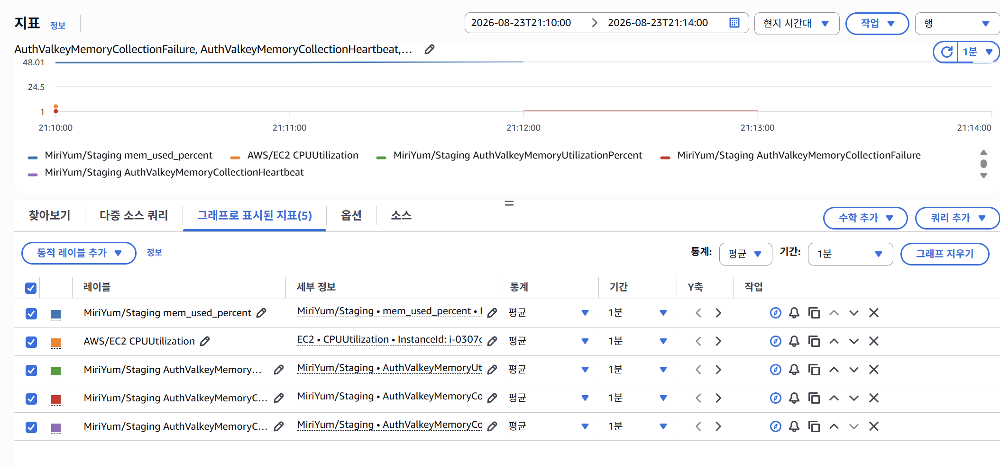

# SSE Runtime 검증 기록

- 소유 Issue: #250
- 실행 증거 Issue: #357
- 기준일: 2026-08-23
- 상태: 정적 계약·전용 실행기 build, staging 간소화 smoke·Valkey recovery `PASS`; 실제 local 부하·장애 `BLOCKED`; staging 대규모 부하·browser·production `NOT RUN`
- 실행 절차: [SSE Runtime 배포·부하·복구 runbook](../deployment/sse-runtime-runbook.md)

## 검증 경계

SSE는 `data: {}` 변경 신호이며 결과 상태는 Notification 이력 또는 Waiting HTTP API와 MySQL에서 다시 읽는다. Valkey Pub/Sub, SSE payload, cursor 또는 keepalive는 원장·전달 성공·상태 성공의 근거가 아니다. 결과에는 credential, Authorization, Token, cookie, cursor, event ID, account/store/team/notification/reservation ID와 전체 URL을 남기지 않는다.

로컬 loadtest 기본 입력은 timeout 30초, heartbeat 5초, correction 2초, correction batch 100, 전체 연결 상한 200, 계정별 연결 상한 6이다. `slow-client` 검증만 timeout 90초·heartbeat 1ms·40초 1회 수신 중단·60초 cleanup 상한·85초 companion 하한을 사용하고 종료 즉시 기본값으로 복원한다. `capacity` 프로필만 단일 계정에 7개 연결을 시도해 예상 429 1건과 나머지 연결·HTTP probe의 격리를 검증하는 음성 테스트다. 이 값들은 운영 상한이나 SLO로 승격하지 않는다.

## 현재 증거

| 항목 | 상태 | 증거 또는 차단 조건 |
|---|---|---|
| 기본 local stack SSE 비활성 | PASS | Compose 계약이 기본 backend에 `MIRIYUM_SSE_ENABLED`와 SSE proxy가 없음을 검증 |
| loadtest bounded SSE 설정 | PASS | Compose 계약이 일곱 SSE 설정, backend-only cursor secret과 별도 proxy를 검증 |
| 실제 Nginx first frame | PASS | Alpine fake upstream이 종료되기 전에 실제 Nginx를 거친 `notifications.changed`, `data: {}` frame을 2초 안에 수신 |
| SSE 실행기 build | PASS | `grafana/xk6:1.4.11` → `k6 v1.2.2` + `xk6-sse v0.1.12`; 실제 `k6/x/sse` import와 `main.js inspect` 성공 |
| 순수 k6 계약 | PASS | target·fixture·event·session·profile·safe summary와 slow 1회 수신 중단·cleanup/companion threshold를 `--network none`에서 검증 |
| 실제 local endpoint smoke | BLOCKED | 기존 local DB의 Flyway V43 실패 기록과 부분 적용 DDL을 안전하게 복구해야 backend가 시작됨 |
| HTTP 비교 3회 | BLOCKED | 같은 SHA·fixture의 성공 SSE smoke proof 필요 |
| steady 25→50→100→200 | BLOCKED | 실제 local smoke와 승인된 synthetic scope 필요 |
| reconnect·slow-client | BLOCKED | 마지막 성공 steady 단계와 smoke proof가 필요하며, slow 실행은 heartbeat burst·cleanup/companion duration 실제 증거까지 필요 |
| Valkey stop/recovery | BLOCKED | 사전 인증 synthetic 계정과 승인된 public owner mutation fixture 필요 |
| same-SHA backend replacement | BLOCKED | 실제 reconnect 실행 입력 필요 |
| staging 간소화 smoke·Valkey recovery | PASS | #357 승인 조건에서 세 endpoint smoke와 waiting-store-operator 1연결·Valkey 고정 10초 중단 recovery 성공 |
| staging 25→50→100→200·reconnect·slow-client·replacement | NOT RUN | 이번 승인 범위는 간소화 smoke와 Valkey recovery 1회이며 대규모 연결 부하는 별도 승인·관찰 계약 필요 |
| browser frontend | NOT RUN | #251·#410·#411 소유 범위 |
| production 활성화 | NOT RUN | #148 및 운영 승인 소유 범위 |

## 승격 규칙

실제 실행은 환경, backend full SHA, harness full SHA, profile, 연결 수, 유지 시간, endpoint kind, 전체 threshold 결과와 비식별 aggregate만 기록한다. 25→50→100→200 중 낮은 단계가 실패하면 상위 단계를 실행하지 않고 마지막 완전 성공 단계만 기록한다. Valkey 중단이나 backend 교체에서 public mutation 승인이 없으면 `BLOCKED`를 유지한다.

운영 timeout·heartbeat·correction·batch·연결 한도와 경보 임계치는 동일 입력의 반복 가능한 부하·장애 증거가 있을 때만 ADR-010과 서비스 정책에 승격한다. 실패 시 `MIRIYUM_SSE_ENABLED=false`로 되돌리고 HTTP/MySQL 재조회를 유지하며, 업무 원장이나 Valkey 데이터를 rollback하지 않는다.

## 2026-08-19 local 실행 시도

- 현재 브랜치 backend Docker build와 SSE 전용 k6 image build는 성공했다.
- 기존 MySQL volume은 삭제하지 않았다. 값 비노출 `SELECT 1`로 volume과 일치하는 local env를 선택했다.
- backend startup은 Flyway V43 `create platform operator management audit`의 과거 실패 기록 때문에 중단됐다. 읽기 전용 확인 결과 V43의 CHECK·UNIQUE 제약과 audit table은 존재하지만 두 immutable trigger는 없어서 단순 Flyway repair로 성공 처리할 수 없는 부분 적용 상태다.
- 주요 비식별 행 수는 consumer account 5, store-operator account 1, store 1, reservation 100, notification task 200, waiting team 0이다. 초기화나 V43 DDL 제거는 실행하지 않았다.
- 다음 단계는 V43이 만든 항목만 정확히 되돌리고 migration을 재실행하는 데이터 보존형 복구 또는 명시적으로 승인된 local DB 초기화다. 복구 승인 전 endpoint smoke와 이후 부하·장애 단계는 `BLOCKED`다.

## 2026-08-23 staging 간소화 smoke·Valkey recovery

### 실행 기준

- 환경: `staging`; 승인·관찰 시간은 2026-08-23 21:10~21:14 KST다. production과 production ALB는 사용하지 않았다.
- backend full SHA: `7d876153b4e65f345179b5bc92b2111342e8033c`
- harness/control full SHA: `ba24cd4faa84598ee90e46fc6bfa24c02f046279`
- fixture fingerprint: `8573de491d1ff8bf9e22886bdd4e92162ad326e87d85023de4302bbafa63baa5`
- 실행 전 `safe-recovery`, 단일 IPv4 load-test 예외 활성화, SSE 활성화와 각 private health가 성공한 뒤 fresh WAITING 1건만 준비했다.

### smoke

`staging-sse-smoke-20260823-07`은 세 endpoint kind에 각 1연결을 사용했다. 전체 threshold가 성공했고 endpoint별 결과는 다음과 같다.

| endpoint kind | first event p95 ms | connection p95 ms | successful | unexpected 4xx | 5xx |
|---|---:|---:|---:|---:|---:|
| notification-consumer | 104 | 104 | 1 | 0 | 0 |
| waiting-consumer | 104 | 105 | 1 | 0 | 0 |
| waiting-store-operator | 101 | 102 | 1 | 0 | 0 |

ignored JSON artifact의 SHA-256은 `9deed441ae8e79645d9c7ef0eee12a075f57fa8c5a82a8785856e16f6da33a77`이다. fixture·자격증명과 artifact 원문은 커밋하지 않는다.

### Valkey 중단·복구

`staging-sse-recovery-20260823-10`은 waiting-store-operator 1연결에서 Valkey를 고정 10초 중단하고 자동 복구했다. READY 뒤 FIRE, ARMED 뒤 SSE open, initial changed event 뒤 공유 epoch mutation 순서로 실행했다.

| 항목 | 관찰값 |
|---|---:|
| threshold | PASS |
| first event p95 | 38 ms |
| connection p95 | 21,821 ms |
| recovery max | 2,109 ms |
| recovery successful | 1 |
| owner HTTP verified | 1 |
| cleanup successful | 1 |
| trigger list·fixture·call·response failure | 각 0 |
| unexpected 4xx·5xx | 각 0 |

ignored JSON artifact의 SHA-256은 `dd5c105620fb428ed7c2a0a5b229f6a335084cbfb0daaf51d59255727ff8cbbd`이다. 장애 제어 [Actions run 32638678428](https://github.com/sparta-spring4/Commerce-Final-Project-MiriYum/actions/runs/32638678428)은 SSM 제출, 고정 중단, 자동 복구와 health를 성공으로 종료했다.

첫 준비 실행 [32638488086](https://github.com/sparta-spring4/Commerce-Final-Project-MiriYum/actions/runs/32638488086)은 로컬 오케스트레이터의 workflow 단계명 불일치로 FIRE 전에 종료됐다. SSM 제출 단계는 `skipped`였고 recovery artifact와 fixture mutation이 없으므로 실행 결과에서 제외했다. 단계명 감지만 바로잡은 뒤 실제 장애 주입은 위 성공 실행에서 1회 수행했다.

### staging 관측과 원복

CloudWatch 1분 평균 그래프에서 승인 시간대의 backend memory 약 48%와 Valkey memory collection failure 1을 관찰했다. 이 지표는 고정 중단 구간의 관측 자료이며 CPU 용량이나 운영 SLO 근거로 사용하지 않는다.

- 사전 안전 복구 [32637912987](https://github.com/sparta-spring4/Commerce-Final-Project-MiriYum/actions/runs/32637912987): `PASS`
- load-test 예외 활성화 [32638085073](https://github.com/sparta-spring4/Commerce-Final-Project-MiriYum/actions/runs/32638085073): `PASS`
- SSE 활성화 [32638238711](https://github.com/sparta-spring4/Commerce-Final-Project-MiriYum/actions/runs/32638238711): `PASS`
- SSE 비활성화 [32638764488](https://github.com/sparta-spring4/Commerce-Final-Project-MiriYum/actions/runs/32638764488): `PASS`
- load-test 예외 제거 [32638866551](https://github.com/sparta-spring4/Commerce-Final-Project-MiriYum/actions/runs/32638866551): `PASS`

모든 재배포는 같은 backend full SHA를 사용했고 private health를 통과했다. 기본 로그인 429 recovery verifier는 예외 제거 뒤 새로운 600초 제한 창에서 실행하지 않았으므로 이번 결과에서는 `NOT RUN`이다. 따라서 이 기록은 staging SSE 간소화 smoke와 Valkey recovery 완료 증거이며 #357의 HTTP baseline, 대규모 SSE 연결과 기본 429 복구까지 완료했다는 근거가 아니다.
