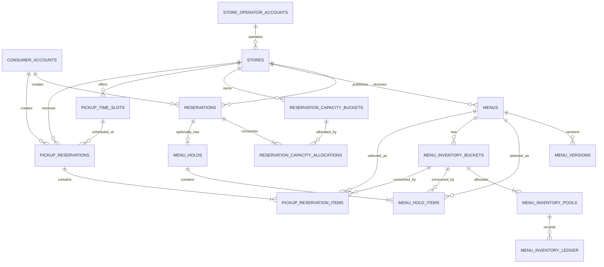

# 1차 MVP 상태 전이와 논리 ERD

> 문서 상태: 3단계 완료
> 추적 Issue: [#25](https://github.com/sparta-spring4/Commerce-Final-Project-MiriYum/issues/25)
> 최종 변경일: 2026-07-28

이 문서는 1차 MVP의 상태 전이, 엔티티 관계와 논리 데이터 제약을 순서대로 확정한다. 승인되지 않은 상태, 관계와 물리 제약은 구현 계약으로 사용하지 않는다.

## 결정 기록

| ID | 결정 | 상태 | 승인일 |
|---|---|---|---|
| `S-001` | 1차 MVP 일반 예약 상태 이름과 단계 경계 | 승인 | 2026-07-28 |
| `S-002` | 1차 MVP 예약 취소의 직접 전이와 원자적 자원 복구 | 승인 | 2026-07-28 |
| `S-003` | 1차 MVP 메뉴 홀드의 즉시 확정 상태와 10분 임시 선점 단계 분리 | 승인 | 2026-07-28 |
| `S-004` | 1차 MVP 픽업 예약의 독립 상태 기계 | 승인 | 2026-07-28 |
| `S-005` | 메뉴 버전·공개·판매 제어·수량 상태 축 분리 | 승인 | 2026-07-28 |
| `S-006` | 계정 유형별 상태 enum과 namespace 기반 최소 권한 | 승인 | 2026-07-28 |
| `S-007` | 매장 입점 검증·운영·픽업 자격 상태 축 분리 | 승인 | 2026-07-28 |
| `E-001` | 도메인 소유 기준 핵심 논리 ERD와 픽업 자원 경계 | 승인 | 2026-07-28 |
| `E-002` | 1차 MVP의 매장 대표 운영자 직접 FK와 고도화 마이그레이션 경계 | 승인(기존 관계 테이블안 대체) | 2026-07-28 |
| `E-003` | 시간 구간별 예약 수용량 버킷과 예약별 배정 이력 | 승인 | 2026-07-28 |
| `E-004` | 시간 구간별 메뉴 재고 버킷·수량 풀과 추가 전용 원장 | 승인 | 2026-07-28 |
| `E-005` | 상태 변경 명령의 멱등 처리와 경합 자원 고정 잠금 순서 | 승인 | 2026-07-28 |
| `E-006` | 핵심 행의 상태 기반 종료, FK 연결과 거래 스냅샷 보존 | 승인 | 2026-07-28 |
| `E-007` | `BIGINT` 대리 PK, 업무 복합 유일성 제약과 확장 안전장치 | 승인 | 2026-07-28 |

## S-001 1차 MVP 일반 예약 상태

### 확정 상태

| 상태 | 한국어 의미 | 1차 MVP 의미 |
|---|---|---|
| `REQUESTED` | 요청 중 | 예약 생성 명령을 접수하고 검증하는 중간 상태 |
| `CAPACITY_HELD` | 수용량 선점 | 날짜·시간 구간의 인원 수와 팀 수를 확보한 중간 상태 |
| `CONFIRMED` | 예약 확정 | 예약 생성이 완료되어 사용자와 매장이 이행해야 하는 활성 상태 |
| `CANCELLED` | 취소 | 유효한 취소 명령으로 예약과 관련 자원이 종결된 상태 |
| `FULFILLED` | 방문·이행 완료 | 매장 운영자가 실제 방문과 예약 이행 완료를 확정한 상태 |
| `REJECTED` | 거절 | 생성 검증이나 허용 조건을 충족하지 못해 확정되지 않은 종결 상태 |
| `EXPIRED` | 만료 | 유효기간 안에 확정하지 못하고 확보한 자원을 해제한 종결 상태 |

### 용어 규칙

- 팀 분담안의 “예약 완료”는 `CONFIRMED`, “방문 완료”는 `FULFILLED`로 해석한다.
- 코드·DB·OpenAPI에서 의미가 모호한 `COMPLETED`는 사용하지 않는다.
- 사용자 화면의 기본 한국어 표시는 각각 `예약 확정`, `방문 완료`, `취소`를 사용한다.
- 상태 문자열은 저장·API 계약에서 위 영문 대문자 값을 사용하고 화면 문구와 분리한다.

### 단계 경계

- `CHANGE_PENDING`과 예약 변경 상세 정책은 삭제하지 않지만, 예약 변경 기능이 팀의 1차 MVP 분담에 포함되지 않았으므로 1차 MVP 상태 진입 경로와 API에서는 활성화하지 않는다.
- 결제 처리·확인·실패 상태와 `PAY-*` 참조는 고도화 전용이며 1차 MVP 예약 enum, 상태 전이표와 API에 포함하지 않는다.
- 체크인·노쇼 후보·확정·정정 상태도 고도화 전용이며 1차 MVP 예약 enum, 상태 전이표와 API에 포함하지 않는다.
- 기존 정책의 `CANCEL_PENDING`은 삭제하지 않지만 1차 MVP 상태 enum과 API에서는 활성화하지 않는다. 외부 결제·비동기 복구가 도입되는 고도화 단계에서 진입 필요성을 다시 검토한다.

### 현재 확정된 전이

| 시작 상태 | 명령·사건 | 종료 상태 | 비고 |
|---|---|---|---|
| 없음 | 예약 생성 접수 | `REQUESTED` | 인증·권한·입력·중복 검증 시작 |
| `REQUESTED` | 인원 수·팀 수 수용량 확보 | `CAPACITY_HELD` | 메뉴 선택 시 메뉴 수량도 같은 트랜잭션에서 검증 |
| `CAPACITY_HELD` | 예약과 선택 메뉴 홀드 전체 확정 | `CONFIRMED` | 결제·매장 승인 전이 없음 |
| `REQUESTED` | 검증 실패 | `REJECTED` | 예약 수용량과 메뉴 수량을 소비하지 않음 |
| `CAPACITY_HELD` | 확정 기한 만료 | `EXPIRED` | 확보한 인원·팀 수와 메뉴 수량을 정확히 한 번 해제 |
| `CONFIRMED` | 방문·이행 완료 확정 | `FULFILLED` | 매장 운영자 권한과 대상 매장의 대표 운영자 FK 일치 검증 |
| `CONFIRMED` | 유효한 사용자·매장 취소 | `CANCELLED` | 예약 수용량과 메뉴 수량 복구를 같은 MySQL 트랜잭션에서 확정 |

### 종결 상태와 금지 전이

- `CANCELLED`, `FULFILLED`, `REJECTED`, `EXPIRED`는 종결 상태다.
- 종결 상태를 이전 상태로 되돌리거나 같은 예약 행을 재활성화하지 않는다.
- 잘못된 상태를 직접 덮어쓰지 않고 필요한 경우 별도 보정 사건을 기록한다.
- `CONFIRMED`와 `FULFILLED`를 같은 상태로 합치지 않는다.

### 인수 조건

- 예약 확정과 방문 완료가 서로 다른 저장 상태와 API 값으로 구분된다.
- 1차 MVP 예약 상태 enum과 OpenAPI에 `COMPLETED`, 결제 상태, `PAY-*`, 체크인 또는 `NO_SHOW` 상태가 없다.
- 예약 변경 API가 없는 상태에서 `CHANGE_PENDING`으로 진입할 수 없다.
- 종결 상태에 대한 재활성화와 허용되지 않은 상태 건너뛰기가 거부된다.

## S-002 1차 MVP 예약 취소 전이

### 확정 전이

```text
CONFIRMED
    │ 유효한 취소 명령
    │ 예약 상태 변경 + 인원·팀 수 복구 + 메뉴 홀드 해제·수량 복구
    ▼ 하나의 MySQL 트랜잭션
CANCELLED
```

- 1차 MVP 취소는 `CONFIRMED`에서 `CANCELLED`로 직접 전이한다.
- 예약 상태 전이, 날짜·시간 구간의 인원·팀 수 복구와 연결된 메뉴 홀드 해제·수량 복구는 하나의 MySQL 트랜잭션에서 함께 커밋한다.
- 모든 변경이 성공해야 취소 판정이 확정된다. 하나라도 실패하면 전체 명령을 롤백하고 예약은 `CONFIRMED`로 유지한다.
- 이미 `CANCELLED`인 예약에 같은 멱등 키와 같은 요청 지문으로 재시도하면 추가 상태 전이나 자원 복구 없이 기존 취소 결과를 반환한다.
- `FULFILLED`, `REJECTED`, `EXPIRED` 등 다른 종결 상태에서 취소 명령을 허용하지 않는다.
- 취소 주체, 귀책과 사유는 상태 enum을 늘리지 않고 별도 취소 사건·감사 데이터로 관리한다.

### 기존 정책과 단계 경계

- `RES-014`가 허용한 직접 `취소` 전이를 1차 MVP에 적용하고 `CANCEL_PENDING`은 활성화하지 않는다.
- `RES-009`의 “확정된 취소 판정 뒤 복구 실패를 별도로 추적”하는 상세 정책은 삭제하지 않는다.
- 1차 MVP에서는 같은 MySQL 트랜잭션의 커밋을 취소 판정의 확정 시점으로 본다. 따라서 내부 자원 복구 실패 전에 취소만 먼저 커밋된 상태를 만들지 않는다.
- 외부 결제·환불 또는 비동기 복구 경계가 생기는 고도화 단계에서는 이미 영속된 취소 판정과 후속 복구 상태를 분리하고 `CANCEL_PENDING` 또는 별도 복구 사건의 필요성을 다시 결정한다.

### 소유권과 잠금 경계

- 3번 팀원의 예약 도메인이 취소 명령, 취소 가능 여부, 예약 상태 전이와 전체 트랜잭션을 조정한다.
- 4번 팀원의 메뉴 홀드 도메인이 `MenuHoldService`의 공개 홀드 해제 메서드로 홀드 해제와 메뉴 수량 복구를 수행한다.
- 예약 도메인은 메뉴 홀드·수량 entity나 repository를 직접 수정하지 않고, 메뉴 홀드 도메인은 예약 상태를 직접 수정하지 않는다.
- 구체적인 잠금 순서와 조건부 갱신식은 논리 ERD의 자원 원장 구조를 확정한 뒤 이 문서에 추가한다.

### 인수 조건

- 취소 상태만 반영되거나 예약 수용량·메뉴 수량 가운데 일부만 복구된 커밋이 없다.
- 동일 취소 요청을 반복하거나 동시에 실행해도 예약은 한 번만 취소되고 각 자원은 한 번만 복구된다.
- 트랜잭션 실패 시 예약은 `CONFIRMED`이고 모든 수용량·메뉴 수량도 취소 전 값이다.
- 1차 MVP 상태 enum과 OpenAPI에 `CANCEL_PENDING`이 없다.
- 취소 응답과 감사 기록에서 사용자 취소와 매장 귀책 취소를 구분할 수 있지만 별도 취소 상태 enum을 만들지 않는다.

## S-003 1차 MVP 메뉴 홀드 상태

### 확정 상태

| 상태 | 한국어 의미 | 1차 MVP 의미 |
|---|---|---|
| `CONFIRMED` | 메뉴 홀드 확정 | 일반 예약과 함께 선택 메뉴 수량이 즉시 확보된 활성 상태 |
| `RELEASED` | 홀드 해제 | 예약 취소로 홀드가 종결되고 수량이 원래 날짜·시간 구간에 복구된 상태 |
| `FULFILLED` | 메뉴 제공 완료 | 방문 시 확정 메뉴가 제공되어 홀드가 이행 완료된 상태 |

- 일반 예약에 메뉴를 선택하지 않으면 `MenuHold`를 만들지 않는다. “건너뛰기”를 나타내는 빈 홀드 행이나 별도 상태를 만들지 않는다.
- `CONFIRMED`, `RELEASED`, `FULFILLED`는 일반 예약 상태와 이름이 일부 같더라도 서로 다른 도메인 enum이다.
- 홀드 상태는 메뉴 기본정보의 게시·판매 상태나 날짜·시간 구간 수량 상태와 합치지 않는다.

### 생성과 취소 전이

```text
메뉴 미선택
    └─ 일반 예약만 CONFIRMED

메뉴 선택
    └─ 일반 예약 CONFIRMED + MenuHold CONFIRMED
       하나의 MySQL 트랜잭션에서 즉시 확정

예약 취소
    └─ 일반 예약 CANCELLED + MenuHold RELEASED
       같은 MySQL 트랜잭션에서 수량 복구

방문·이행 완료
    └─ 일반 예약 FULFILLED + MenuHold FULFILLED
```

- 복수 메뉴 가운데 하나라도 수량·자격·구간 검증에 실패하면 예약과 모든 메뉴 홀드를 롤백한다.
- 프런트엔드가 예약 생성 뒤 별도 홀드 확정 API를 호출하거나, 메뉴별 홀드 API를 순서대로 호출해 원자성을 대신하지 않는다.
- 같은 멱등 키와 요청 지문의 재시도는 기존 예약과 홀드 결과를 반환하고 수량을 추가 차감하지 않는다.
- `RELEASED`와 `FULFILLED`는 종결 상태이며 다시 `CONFIRMED`로 되돌리지 않는다.

### 10분 임시 선점 정책의 단계 경계

- 1차 MVP는 결제·다단계 사용자 확인 없이 하나의 예약 생성 요청에서 예약과 선택 메뉴 홀드를 즉시 확정하거나 전체 롤백한다.
- 따라서 1차 MVP에는 사용자에게 노출되는 임시 선점, 별도 확정 API, 장시간 유지되는 `PENDING` 상태와 10분 만료 작업을 두지 않는다.
- 기존 `HOLD-004`·`HOLD-007`의 10분 임시 선점 세부 정책은 삭제하지 않는다. 결제 또는 다단계 확인 흐름이 활성화되는 고도화 전용으로 단계 표기를 보강한다.
- 고도화에서도 10분 동안 DB 트랜잭션을 열어 두지 않는다. 임시 선점 행과 만료 시각을 커밋하고, 별도 확정·만료 명령과 멱등 복구 작업으로 관리한다.

### 소유권과 수량 원장

- 3번 팀원의 예약 도메인이 일반 예약 생성·취소·방문 완료 명령과 전체 트랜잭션을 조정한다.
- 4번 팀원의 메뉴 홀드 도메인이 `MenuHold`, 날짜·시간 구간별 수량 차감·복구와 홀드 상태 전이를 소유한다.
- 메뉴 홀드는 2번 팀원이 소유한 메뉴 기본정보를 복제·수정하지 않고 `menu_id`, 확정 당시 메뉴명·가격·정책 버전처럼 거래 재현에 필요한 스냅샷만 저장한다.
- 구체적인 메뉴 수량 원장 테이블과 유일 제약은 논리 ERD 결정에서 확정한다.

### 인수 조건

- 메뉴를 건너뛴 일반 예약에 빈 `MenuHold`나 건너뛰기 상태가 생성되지 않는다.
- 메뉴를 선택한 예약은 일반 예약과 모든 메뉴 홀드가 함께 `CONFIRMED`이거나 아무것도 생성·차감되지 않는다.
- 예약 취소 시 연결된 모든 메뉴 홀드가 한 번만 `RELEASED`되고 날짜·시간 구간별 수량이 한 번만 복구된다.
- 1차 MVP 메뉴 홀드 enum과 OpenAPI에 `PENDING`, 결제 상태와 10분 임시 선점 확정 API가 없다.

## S-004 1차 MVP 픽업 예약 상태

### 확정 상태

| 상태 | 한국어 의미 | 1차 MVP 의미 |
|---|---|---|
| `CONFIRMED` | 픽업 예약 확정 | 픽업 시간대와 메뉴 수량이 확보된 활성 상태 |
| `PICKED_UP` | 수령 완료 | 사용자가 메뉴를 수령해 픽업 거래가 이행 완료된 종결 상태 |
| `CANCELLED` | 픽업 취소 | 유효한 취소로 거래가 종결되고 메뉴 수량이 복구된 상태 |

```text
CONFIRMED ── 매장 운영자의 수령 완료 처리 ──▶ PICKED_UP
     │
     └──── 유효한 사용자·매장 취소 ────────▶ CANCELLED
```

### 일반 예약·메뉴 홀드와의 분리

- 픽업 예약은 `PickupReservation`과 전용 상태 enum을 사용하며 일반 `Reservation`이나 `ReservationStatus`를 생성·재사용하지 않는다.
- 픽업 예약은 메뉴 수량과 픽업 제공 구간만 소비하고 일반 예약의 인원 수·팀 수를 소비하지 않는다.
- 픽업 예약의 메뉴 항목과 수량 원장은 4번 팀원의 메뉴 홀드·픽업 도메인이 소유한다.
- 2번 팀원의 매장 도메인은 중앙 픽업 자격과 매장·메뉴 기본정보를 제공하지만 픽업 예약 상태를 직접 변경하지 않는다.

### 명령과 자원 처리

- 생성은 매장 픽업 자격, 기능 활성 여부, 영업·픽업 구간, 메뉴 게시·홀드 자격과 날짜·시간 구간별 수량을 검증한 뒤 `CONFIRMED`로 즉시 확정한다.
- 취소는 `CONFIRMED`에서만 허용하고 `CANCELLED` 전이와 메뉴 수량 복구를 하나의 MySQL 트랜잭션에서 커밋한다.
- 수령 완료는 대상 매장의 대표 운영자 FK와 일치하는 매장 운영자만 `CONFIRMED`에서 `PICKED_UP`으로 전이할 수 있다.
- `PICKED_UP`과 `CANCELLED`는 종결 상태이며 서로 전환하거나 `CONFIRMED`로 되돌리지 않는다.
- 같은 멱등 키와 요청 지문의 생성·취소·수령 완료 재시도는 기존 결과를 반환하고 수량 또는 상태 전이를 중복 적용하지 않는다.

### 제외 상태와 후속 단계

- `READY_FOR_PICKUP`은 매장의 준비 완료 명령·화면·API가 팀의 1차 MVP 분담에 없으므로 활성화하지 않는다.
- 픽업 시간·수량 변경 API도 1차 MVP 분담에 없으므로 기존 상세 정책은 삭제하지 않되 상태 진입 경로와 API를 활성화하지 않는다.
- 결제, 환불, 임시 선점과 결과 대사 상태는 고도화 전용이며 픽업 예약 상태 enum과 API에 미리 넣지 않는다.

### 인수 조건

- 픽업 예약 생성으로 일반 예약 행이나 인원·팀 수 점유가 생성되지 않는다.
- 다른 업종이나 중앙 픽업 자격이 유효하지 않은 매장은 픽업 예약을 확정할 수 없지만 일반 매장·예약 기능은 영향을 받지 않는다.
- 동일 취소를 반복·동시 실행해도 상태는 한 번만 `CANCELLED`가 되고 메뉴 수량은 한 번만 복구된다.
- `PICKED_UP` 뒤 취소·수량 복구가 거부된다.
- 1차 MVP 픽업 상태 enum과 OpenAPI에 `READY_FOR_PICKUP`, 결제 또는 임시 선점 상태가 없다.

## S-005 1차 MVP 메뉴 상태 축

메뉴의 작성·공개·운영 제어와 날짜·시간 구간별 수량을 하나의 `MenuStatus`로 합치지 않는다.

### 확정 상태 축

| 상태 축 | 값 | 의미 | 소유자 |
|---|---|---|---|
| 메뉴 버전 | `DRAFT`, `SCHEDULED`, `PUBLISHED`, `RETIRED` | 작성 중, 게시 예약, 게시 중, 종료된 불변 메뉴 버전 | 2번·매장 도메인 |
| 공개 여부 | `VISIBLE`, `HIDDEN` | 검색·목록·상세에서 사용자에게 공개할지 여부 | 2번·매장 도메인 |
| 판매 제어 | `SELLING`, `PAUSED` | 매장 운영자가 신규 거래를 받을지 중단할지 여부 | 2번·매장 도메인 |
| 수량 가용성 | `AVAILABLE`, `SOLD_OUT` | 홀드·픽업 수량 관리 메뉴의 날짜·시간 구간별 신규 수량 가능 여부 | 4번·메뉴 홀드·픽업 도메인 |

### 상태 전이

```text
메뉴 버전: DRAFT ──▶ SCHEDULED ──▶ PUBLISHED ──▶ RETIRED
                       │ 취소
                       └──────────▶ DRAFT

공개 여부: VISIBLE ◀──────────────▶ HIDDEN
판매 제어: SELLING ◀──────────────▶ PAUSED
수량 가용성: AVAILABLE ◀──────────▶ SOLD_OUT
```

- 즉시 게시는 `DRAFT`에서 `PUBLISHED`로 바로 전이할 수 있다.
- `PUBLISHED` 버전의 내용을 직접 덮어쓰지 않고 변경 내용을 가진 새 `DRAFT` 버전을 게시한다.
- `RETIRED` 버전은 과거 거래 스냅샷 재현을 위해 보존하며 다시 활성화하지 않는다.
- `HIDDEN`은 공개 노출만 차단하며 재고 부족을 뜻하지 않는다.
- `PAUSED`는 매장 운영자의 판매 중단이며 수량이 0이라는 뜻이 아니다.
- `SOLD_OUT`은 메뉴 전체의 영구 상태가 아니라 홀드·픽업 날짜·시간 구간별 수량 가용성이다.
- 수량 관리 메뉴는 중앙 수량이 0이 되면 `SOLD_OUT`, 유효한 복구·증가로 1개 이상이 되면 `AVAILABLE`로 판정할 수 있다.

### 최종 신규 선택 가능 조건

```text
PUBLISHED
AND VISIBLE
AND SELLING
AND (
  수량 관리 대상이 아님
  OR 해당 날짜·시간 구간이 AVAILABLE
)
```

- 검색·목록에 표시할 수 있는 조건과 홀드·픽업으로 신규 선택할 수 있는 조건은 같지 않다.
- `PUBLISHED + VISIBLE + SELLING + SOLD_OUT` 메뉴는 매장 운영자가 숨기지 않은 경우 품절 표시와 함께 조회할 수 있지만 신규 수량 거래는 차단한다.
- 직접 링크나 오래된 검색 결과를 사용해도 쓰기 시점에 네 상태 축과 중앙 수량을 다시 검증한다.

### 소유권과 변경 규칙

- 2번 팀원은 메뉴 상품·불변 버전, 게시·공개·판매 제어 상태와 검색 표시를 소유한다.
- 4번 팀원은 날짜·시간 구간 수량 원장과 `AVAILABLE`·`SOLD_OUT` 판정을 소유한다.
- 2번 팀원은 수량 원장을 직접 수정하지 않고, 4번 팀원은 메뉴 버전·공개·판매 제어 상태를 직접 변경하지 않는다.
- 검색·상세에서 수량 상태가 필요하면 2번 팀원은 4번 팀원의 `MenuQuantityQueryService` 결과를 조합한다.
- 플랫폼 운영자의 정책 위반 강제 숨김은 고도화 전용이며 1차 MVP의 `HIDDEN`은 매장 운영자의 공개 설정만 나타낸다.

### 인수 조건

- `HIDDEN`, `PAUSED`, `SOLD_OUT`이 서로 다른 저장 상태와 사용자 표시로 구분된다.
- 수량이 복구되어도 `PAUSED` 또는 `HIDDEN`인 메뉴가 자동으로 판매·공개 상태가 되지 않는다.
- 메뉴를 다시 공개해도 `PAUSED` 또는 해당 구간 `SOLD_OUT`이면 신규 홀드·픽업을 생성할 수 없다.
- 하나의 `MenuStatus` enum에 게시·노출·판매·수량 값을 혼합하지 않는다.
- 날짜·시간 구간이 다른 두 수량 상태가 메뉴 기본정보 행을 서로 덮어쓰지 않는다.

## S-006 1차 MVP 계정 상태와 권한

### 계정 유형별 상태

```text
ConsumerAccountStatus
├─ ACTIVE
└─ SUSPENDED

StoreOperatorAccountStatus
├─ ACTIVE
└─ SUSPENDED
```

- `consumer_accounts`와 `store_operator_accounts`는 각각 자신의 상태 enum을 사용하고 공통 `AccountStatus`나 공통 계정 상속 테이블을 사용하지 않는다.
- 회원가입 필수 본인·이메일 확인이 끝나기 전에는 활성 계정 행을 만들지 않으므로 `PENDING` 계정 상태를 두지 않는다.
- 로그인 실패 지연은 일시적인 인증 방어 값이며 계정 자체의 상태가 아니므로 `LOCKED` 상태로 저장하지 않는다.
- `SUSPENDED` 계정은 로그인·재발급과 인증 필수 기능을 사용할 수 없고, 서명·만료가 유효한 기존 Access JWT를 제출해도 중앙 계정 상태 검증에서 거부된다.
- 1차 MVP 공개 API에는 임의 정지·정지 해제 명령을 노출하지 않는다. 보안·운영 정책에 따른 중앙 상태로만 소비하며 전이 권한은 플랫폼 운영 기능이 활성화될 때 별도로 확정한다.

### Spring Security 권한

```text
ROLE_CONSUMER
ROLE_STORE_OPERATOR
```

- 이 권한은 계정 테이블의 `role` 열에 저장하지 않고, 계정 유형별 로그인 경로·principal·토큰 발급자 또는 대상과 namespace에서 결정한다.
- 일반 사용자와 매장 운영자의 이메일·휴대전화가 같아도 계정·principal·권한·JWT namespace를 병합하거나 전환하지 않는다.
- 클라이언트가 보낸 `role`·`accountType`으로 권한을 선택하거나 승격하지 않는다.
- `ROLE_STORE_OPERATOR`는 “매장 운영자 계정으로 인증됨”만 뜻하며 특정 매장의 관리 권한을 뜻하지 않는다.
- 매장 관리 명령은 대상 매장의 `store_operator_account_id` 일치와 매장 상태를 추가 검증해야 한다.
- 플랫폼 운영자 계정·principal·권한은 고도화에서 별도 추가하며 1차 MVP에 `ROLE_ADMIN`이나 플랫폼 운영자용 열을 미리 만들지 않는다.

### 단계 경계

- 탈퇴 대기·최종 삭제, 수동 계정 복구와 그에 따른 세부 상태는 기존 정책에서 삭제하지 않는다.
- 해당 기능은 현재 1차 MVP 팀 분담에 없으므로 이번 상태 enum, OpenAPI와 구현 진입 경로에서는 활성화하지 않는다.
- 고도화 기능을 추가할 때도 `consumer_accounts`와 `store_operator_accounts`를 공통 계정 테이블로 합치지 않고 각 계정 유형의 상태 기계를 독립적으로 확장한다.

### 인수 조건

- 두 계정 테이블에 `role`·`account_type` discriminator 열이 없다.
- 일반 사용자 JWT로 매장 운영자 API를 호출하거나 반대 namespace의 토큰을 갱신할 수 없다.
- `ROLE_STORE_OPERATOR`만 보유하고 대상 매장의 대표 운영자 FK와 일치하지 않는 계정은 해당 매장 관리 명령을 실행할 수 없다.
- 정지 계정은 유효한 Access JWT가 있어도 보호 명령을 실행할 수 없다.
- 1차 MVP 코드와 OpenAPI에 `ROLE_ADMIN`, 플랫폼 운영자 API와 탈퇴·수동 복구 상태가 없다.

## S-007 1차 MVP 매장 상태 축

입점 검증, 매장의 운영 상태와 픽업 자격을 하나의 `StoreStatus`로 합치지 않는다.

### 확정 상태 축

| 상태 축 | 값 | 의미 |
|---|---|---|
| 입점 검증 | `VERIFYING`, `VERIFICATION_PENDING`, `APPROVED`, `REJECTED` | 1차 MVP 더미 사업자 기준 데이터·중앙 중복 판정의 처리 결과. 공식 진위확인은 고도화에서 대체 |
| 매장 운영 | `OPEN`, `TEMPORARILY_CLOSED`, `CLOSED` | 영업, 휴점, 폐점의 중앙 운영 상태 |
| 픽업 자격 | `UNVERIFIED`, `ELIGIBLE`, `INELIGIBLE` | 1차 MVP의 카페·베이커리 더미 업종 판정. 정확한 코드는 구현 fixture가 소유하며 공식 업종·버전 매핑은 고도화 전용 |

### 입점 검증 전이

```text
VERIFYING ── 정상 검증·고유성 확인 ──▶ APPROVED
    │
    ├─ 외부 조회 결과 미확정 ───────▶ VERIFICATION_PENDING
    │                                  │ 재검증
    │                                  └────────▶ VERIFYING
    │
    └─ 정보 불일치·중복·허용 불가 ──▶ REJECTED
```

- 정상 고유 신청은 구조화 사업자 정보의 공식 자동 검증이 완료되면 플랫폼 운영자 승인 없이 `APPROVED`로 전이한다.
- 외부 조회 장애처럼 성공·실패를 확정할 수 없으면 `VERIFICATION_PENDING`에서 재입력·재조회만 허용한다.
- 핵심 정보 불일치, 중복 사업자등록번호와 허용되지 않은 사업자 상태는 `REJECTED`로 종결한다.
- 사업자등록증 이미지, S3, 플랫폼 운영자의 승인·보완·반려 상태는 고도화 전용이며 1차 MVP enum에 넣지 않는다.

### 운영 상태 전이

```text
OPEN ◀────────────▶ TEMPORARILY_CLOSED
  │                         │
  └───────────────▶ CLOSED ◀┘
```

- 매장 운영자는 정책이 허용한 절차로 `OPEN`과 `TEMPORARILY_CLOSED` 사이를 전환할 수 있다.
- `CLOSED`는 폐점 종결 상태이며 1차 MVP에서 다시 `OPEN`으로 되돌리지 않는다.
- 정규 영업시간 밖, 브레이크타임 또는 개별 휴무라는 사실만으로 중앙 운영 상태를 `TEMPORARILY_CLOSED`로 변경하지 않는다.
- 사용자에게 표시할 현재 영업 여부는 `OPEN` 여부, 정규 영업시간, 브레이크타임과 적용 중인 휴무·임시 휴점 사건을 중앙 시각으로 조합해 계산한다.

### 픽업 자격 전이와 독립성

- 공식 업종 값을 확인할 수 없으면 `UNVERIFIED`, 확인했지만 허용 매핑과 일치하지 않으면 `INELIGIBLE`, 확인과 매핑이 모두 유효하면 `ELIGIBLE`이다.
- 검색 카테고리·태그와 운영자의 자기 입력으로 `ELIGIBLE`을 만들거나 변경하지 않는다.
- 입점 검증과 픽업 자격은 독립적이므로 `APPROVED + INELIGIBLE` 또는 `APPROVED + UNVERIFIED` 매장도 일반 매장·예약 기능을 사용할 수 있다.
- 픽업 예약 신규 생성은 `APPROVED + OPEN + ELIGIBLE`을 모두 만족하고 영업·픽업 제공 구간과 메뉴 수량 검증까지 통과해야 한다.
- 픽업 자격의 부재·실패가 입점 승인이나 일반 예약 기능 상태를 바꾸지 않는다.

### 소유권과 인수 조건

- 세 상태 축은 모두 2번 팀원의 매장 도메인이 소유한다. 4번 팀원의 픽업 도메인은 `StorePickupEligibilityService`로 현재 자격을 검증한다.
- 하나의 `StoreStatus` enum에 승인·영업·픽업 값을 혼합하지 않는다.
- `APPROVED`가 아닌 매장은 공개·신규 거래 기능을 사용할 수 없다.
- `APPROVED + OPEN`이어도 `ELIGIBLE`이 아니면 픽업만 거부되고 일반 예약은 가능하다.
- 영업시간 밖이라는 이유만으로 매장 운영 상태 이력이 변경되지 않는다.
- 1차 MVP 코드와 OpenAPI에 플랫폼 운영자 수동 심사 상태가 없다.

## E-001 핵심 논리 ERD와 픽업 자원 경계

### 확정 구조



### 계정과 매장

- 일반 사용자와 매장 운영자는 각각 `consumer_accounts`, `store_operator_accounts`를 사용하며 공통 `users` 테이블을 만들지 않는다.
- 일반 사용자는 일반 방문 예약과 픽업 예약의 거래 소유자다.
- 1차 MVP의 매장은 `store_operator_account_id`로 현재 대표 운영자 계정을 직접 참조한다. 계정 행이나 JWT에 관리 매장 목록을 중복 저장하지 않는다.
- 매장은 메뉴, 일반 방문 예약, 예약 수용량 구간, 픽업 제공 구간과 픽업 예약의 기준 매장이다.

### 일반 방문 예약과 선택 메뉴 홀드

- `reservations`는 일반 사용자가 매장을 방문해 현장에서 이용하는 예약이다.
- 일반 방문 예약은 겹치는 모든 `reservation_capacity_buckets`의 인원 수와 팀 수를 `reservation_capacity_allocations`로 소비한다.
- 메뉴를 건너뛴 일반 예약에는 `menu_holds`가 없다.
- 메뉴를 하나 이상 선택하면 예약 하나에 `menu_holds` 하나를 만들고, 선택 메뉴별 `menu_hold_items`가 같은 날짜·시간 구간의 `menu_inventory_buckets`를 소비한다.
- 예약과 선택 메뉴 홀드는 하나의 MySQL 트랜잭션에서 함께 확정하거나 전체 롤백한다.

### 픽업 예약의 공통점과 분리점

- 픽업은 사용자가 날짜·시간과 메뉴 수량을 지정하고 매장이 그 이행을 약속한다는 점에서 예약성 거래다.
- 픽업 예약은 `pickup_reservations`와 `pickup_reservation_items`로 관리하고, 일반 `reservations` 행이나 `ReservationStatus`를 재사용하지 않는다.
- 픽업 예약은 일반 방문 예약의 인원·팀 수 수용량과 분리하되, 일반 예약의 선택 메뉴 홀드와 동일한 날짜·시간대별 메뉴 재고 원장을 공유한다.
- 따라서 픽업 예약은 `reservation_capacity_buckets`와 `reservation_capacity_allocations`를 만들거나 소비하지 않는다.
- 픽업 예약 항목은 일반 예약의 메뉴 홀드 항목과 같은 `menu_inventory_buckets`를 차감하고 모든 수량 변화는 같은 `menu_inventory_ledger`에 기록한다.
- 픽업 시간 약속은 `pickup_time_slots`를 사용하며 일반 방문 예약의 좌석성 수용량과 의미를 합치지 않는다.

### 채택하지 않는 구조

- 예약과 픽업을 공통 `bookings` 부모와 공통 상태 enum으로 합치지 않는다.
- 픽업을 `reservation_type = PICKUP`, `party_size = 0`인 일반 예약으로 저장하지 않는다.
- 일반 방문 수용량과 메뉴 재고를 하나의 공통 자원 수량 열이나 원장으로 합치지 않는다.
- 팀별 도메인 테이블을 편의상 상대 담당자의 entity 상속 구조나 공통 repository로 묶지 않는다.

### 후속 계약 경계

- 매장 대표 운영자 FK와 핵심 업무 중복의 논리 제약은 E-002·E-007을 따른다.
- 수용량·재고 원장의 잠금 순서와 멱등 명령은 E-005를 따른다.
- 교차 도메인 FK의 삭제·보존과 거래 스냅샷은 E-006을 따른다.
- 정확한 DDL 문법, HTTP 멱등 헤더, 오류 코드와 날짜·시간 직렬화는 4단계 공통 계약과 실제 Flyway 마이그레이션 설계에서 이 불변식을 바꾸지 않는 범위로 확정한다.

### 인수 조건

- 1차 MVP 스키마에 공통 `users`, 공통 `bookings`와 픽업용 일반 예약 행이 없다.
- 픽업 생성으로 예약 인원·팀 수가 줄지 않지만 같은 메뉴·시간대의 일반 예약 메뉴 홀드와 픽업 예약은 같은 메뉴 재고를 두고 경합한다.
- 메뉴 미선택 일반 예약에는 빈 홀드·빈 홀드 항목이 생성되지 않는다.
- 복수 메뉴를 선택한 일반 예약과 픽업 예약이 각 거래의 항목으로 표현되고 메뉴 수량 원장에 정확히 연결된다.
- 각 핵심 테이블의 소유자가 O-009 소유권 표와 일치한다.

## E-002 매장 대표 운영자 직접 FK

### 확정 구조

```text
store_operator_accounts 1 ─── N stores
                               └─ store_operator_account_id FK
```

- 한 매장 운영자 계정은 여러 매장을 관리할 수 있다.
- 1차 MVP에서 한 매장은 `stores.store_operator_account_id`로 정확히 한 명의 대표 운영자만 참조한다.
- 현재 관리 권한은 인증된 운영자 계정 ID와 대상 매장의 FK가 일치하고 두 자원의 상태가 요청을 허용할 때 성립한다.
- 직원·공동 관리자·부관리자 역할, 소속 유효기간·권한 버전과 명의 양도 이력은 1차 MVP에서 구현하지 않는다.

### 고도화 전환 경계

- 다중 운영자·직원 역할·명의 양도 중 하나를 활성화할 때 별도 관계 테이블을 도입한다.
- 기존 `stores.store_operator_account_id` 값은 각 매장의 최초 `OWNER` 관계로 이관하고, 검증이 끝난 뒤 권한 조회 원본을 관계 테이블로 한 번만 전환한다.
- 공개 API 응답에 내부 운영자 FK를 노출하지 않으므로 이 마이그레이션은 클라이언트 계약을 변경하지 않는다.
- 명의 양도용 공개 API와 FK 직접 변경 기능은 1차 MVP에 포함하지 않는다.

### 채택하지 않는 구조

- 1차 MVP에 사용하지 않는 소속 관계 테이블과 역할·유효기간 열을 미리 만들지 않는다.
- 매장 FK와 관계 테이블을 동시에 권한 판단에 사용하는 이중 원본 구조를 만들지 않는다.
- 계정 행이나 JWT에 관리 매장 ID 목록을 저장하지 않는다.
- 플랫폼 운영자 계정을 매장 소유자 또는 대표 운영자로 연결하지 않는다.

### 논리 제약과 조회 규칙

- `stores.store_operator_account_id`는 `store_operator_accounts.id`를 참조하며 연쇄 삭제하지 않는다.
- 한 운영자 ID를 여러 매장이 참조할 수 있으므로 이 FK에 유일 제약을 두지 않는다.
- 매장 관리 요청은 인증된 운영자 계정, 계정 활성 상태, 대상 매장의 FK 일치와 매장 상태를 모두 검사한다.
- 운영자 확인은 매장 도메인의 한 공개 권한 확인 경계로 모아 이후 관계 테이블 전환 시 소비 도메인과 공개 API를 변경하지 않는다.

### 소유권

- 1번 담당자는 `store_operator_accounts`와 운영자 인증 principal을 소유한다.
- 2번 담당자는 `stores`, 대표 운영자 FK와 매장 운영 권한 확인 규칙을 소유한다.
- 다른 도메인은 매장 entity나 FK를 직접 수정하지 않고 2번 담당자가 공개한 매장 운영 권한 확인 계약을 사용한다.

### 인수 조건

- 한 운영자가 두 개 이상의 매장의 대표 운영자가 될 수 있다.
- 다른 운영자는 대상 매장 ID를 알아도 조회·변경 권한을 얻지 못한다.
- 1차 MVP 스키마에 `store_operator_store_affiliations`와 미사용 역할·유효기간 열이 없다.
- 명의 양도나 다중 운영자 요구가 생기기 전에는 `store_operator_account_id`를 변경하는 공개 API가 없다.
- 권한 확인 로직과 공개 API가 내부 FK 구조를 캡슐화하여 관계 테이블 전환 가능성을 보존한다.

## E-003 예약 수용량 버킷과 배정 이력

### 확정 구조

```text
stores
  └─ reservation_capacity_buckets
       ├─ 날짜·시간 구간
       ├─ 전체 예약 가능 인원 수
       ├─ 전체 예약 가능 팀 수
       ├─ 현재 점유량
       └─ 수용량 정책 버전

reservations
  └─ reservation_capacity_allocations
       ├─ reservation_capacity_bucket
       ├─ 점유 인원 수
       └─ 점유 팀 수 = 1
```

- 예약 자원은 개별 좌석이나 테이블이 아니라 매장 날짜·시간 구간별 `reservation_capacity_buckets`다.
- 각 버킷은 전체 예약 가능 인원 수와 전체 예약 가능 팀 수를 함께 관리한다.
- 예약 하나는 실제 점유 시간과 조금이라도 겹치는 모든 버킷에 `reservation_capacity_allocations`를 하나씩 가진다.
- 각 배정은 요청 전체 인원 수와 팀 수 1건을 해당 버킷에 점유한다.
- 예약이 참조한 수용량 정책 버전과 당시 배정 이력은 이후 설정 변경에도 보존한다.

### 예약 가능 판정

모든 겹치는 버킷에서 다음 두 조건을 동시에 만족해야 한다.

```text
현재 점유 인원 수 + 요청 인원 수 <= 전체 예약 가능 인원 수
현재 점유 팀 수 + 1 <= 전체 예약 가능 팀 수
```

- 한 조건이라도 만족하지 못하거나 필요한 버킷을 조회할 수 없으면 예약을 확정하지 않는다.
- 겹치는 버킷 일부만 확보한 부분 성공을 허용하지 않는다.
- 예약 가능 조회 결과는 확정 보장이 아니며 예약 생성 트랜잭션에서 현재 원장을 다시 검증한다.
- 개별 좌석 번호, 테이블 번호·조합 또는 좌석 위치를 수용량 계약에 추가하지 않는다.

### 배정과 복구

- 예약 확정 시 모든 대상 버킷의 인원 수와 팀 수를 하나의 MySQL 트랜잭션에서 함께 점유한다.
- 예약 취소 시 연결된 모든 배정을 기준으로 원래 점유한 인원 수와 팀 수를 같은 트랜잭션에서 정확히 한 번 복구한다.
- 배정 이력은 취소 후 삭제하지 않고 예약과 버킷의 과거 관계를 보존한다.
- 정책 버전 변경은 기존 버킷과 배정을 덮어쓰지 않고 이후 예약에 적용할 새 버전으로 게시한다.
- 운영 중지는 신규 점유만 차단하며 이미 확정된 예약과 배정 이력을 임의 삭제하거나 다른 버킷으로 옮기지 않는다.

### 채택하지 않는 구조

- 인원 수와 팀 수를 서로 다른 예약 자원 테이블로 분리하지 않는다.
- 예약 행을 매번 합산한 값만으로 동시 예약 가능 여부를 판정하지 않는다.
- 슬롯 하나에 예약 하나만 허용하는 유일 제약으로 수용량을 대신하지 않는다.
- `reservations`에 모든 구간의 현재 수용량이나 매장 전체 잔여 수용량을 중복 저장하지 않는다.

### 소유권과 미확정 물리 제약

- 3번 담당자의 예약 도메인이 수용량 버킷, 배정 이력, 예약 가능 판정과 취소 복구를 소유한다.
- 2번 담당자의 매장 도메인은 운영시간과 예약 접수 시간대 정보를 제공하지만 수용량 원장을 직접 수정하지 않는다.
- 버킷의 정확한 유일 키, 점유량 열의 세분화, 배정 상태 값, 조건부 갱신 SQL과 고정 잠금 순서는 후속 동시성 결정에서 확정한다.
- FK의 삭제·보존 방식과 물리 인덱스는 후속 데이터 보존 결정에서 확정한다.

### 인수 조건

- 인원 수 한도가 남아도 팀 수 한도가 찼으면 예약이 거부되며 그 반대도 동일하다.
- 한 예약이 세 개의 시간 구간과 겹치면 세 버킷 모두에 같은 요청 인원과 팀 1건이 배정된다.
- 필요한 버킷 중 하나라도 부족하면 어느 버킷에도 점유나 배정이 커밋되지 않는다.
- 동시 예약 성공 결과의 인원 수와 팀 수 합계가 어느 버킷에서도 각각의 최대값을 초과하지 않는다.
- 예약 취소를 반복·동시 실행해도 모든 버킷의 인원 수와 팀 수가 정확히 한 번만 복구된다.
- 수용량 정책을 변경해도 기존 예약이 참조한 버킷·버전과 배정 이력을 추적할 수 있다.

## E-004 메뉴 재고 버킷·수량 풀과 원장

### 기존 정책 검증 결과

- `HOLD-002`의 메뉴별 제공 날짜·시간 구간과 구간별 판매 가능 수량 정책을 유지한다.
- `HOLD-008`의 총 공급 안에서 온라인 홀드·현장 판매·공유 수량 풀을 분리하는 정책을 유지한다.
- `HOLD-010`의 실제 차감 원장 기준 원래 풀 복구와 `HOLD-013`의 추가 전용 감사 원장을 유지한다.
- 따라서 단일 버킷 행에 총수량과 잔여수량만 저장하는 최초 후보안은 채택하지 않고 수량 풀을 명시한 보정안을 사용한다.

### 확정 구조

```text
menus
  └─ menu_inventory_buckets
       ├─ 제공 날짜·시간 구간
       ├─ 총 공급 수량
       └─ 수량 정책 버전
            │
            ├─ menu_inventory_pools
            │    ├─ ONLINE_HOLD
            │    ├─ ONSITE
            │    └─ SHARED
            │
            └─ menu_inventory_ledger
                 ├─ 원래 수량 풀
                 ├─ 증감 수량과 변경 전·후 수량
                 ├─ 원인 거래·명령
                 └─ 정책 버전·멱등 키·중앙 시각
```

- `menu_inventory_buckets`는 메뉴와 제공 날짜·시간 구간별 총 공급과 정책 버전을 나타낸다.
- `menu_inventory_pools`는 같은 버킷의 물리 수량을 `ONLINE_HOLD`, `ONSITE`, 필요한 경우 `SHARED`로 배분한다.
- 각 풀의 배분 합계는 버킷의 총 공급 수량을 넘을 수 없고 같은 물리 수량을 여러 풀에 중복 산입하지 않는다.
- 풀별 가용량은 음수가 될 수 없으며 모든 차감·복구·이동은 현재 수량 버전을 조건부로 갱신한다.
- 메뉴 기본정보와 메뉴 버전 행에는 날짜·시간대별 총 공급, 풀별 배분이나 현재 가용량을 저장하지 않는다.

### 일반 메뉴 홀드와 픽업 예약의 공유 범위

- 일반 방문 예약의 선택 메뉴 홀드와 픽업 예약은 동일한 메뉴·제공 구간의 `ONLINE_HOLD` 수량을 공유한다.
- 두 거래를 위해 별도의 일반 예약용·픽업용 재고 버킷이나 온라인 수량 풀을 만들지 않는다.
- 매장의 버전된 정책이 허용할 때만 두 거래 모두 정해진 동일 순서로 `SHARED` 수량을 사용할 수 있다.
- `ONSITE` 수량은 온라인 거래가 임의로 차감하지 않고, 현장 판매도 `ONLINE_HOLD` 수량을 임의로 차감하지 않는다.
- 픽업 예약은 메뉴 재고를 공유하더라도 일반 예약의 인원·팀 수 수용량은 사용하지 않는다.

### 차감·복구·운영자 조정

- 거래 항목 하나는 정확히 하나의 메뉴 제공 구간을 선택하고 실제 차감한 버킷·풀·수량·정책 버전을 참조한다.
- 일반 예약 메뉴 홀드와 픽업 예약 생성은 필요한 모든 메뉴 수량을 확보하거나 전체 실패한다.
- 유효한 취소는 실제 차감 원장을 기준으로 같은 버킷의 원래 수량 풀에 수량을 정확히 한 번 복구한다.
- 판매 종료나 품절 때문에 신규 판매가 닫혀 있어도 원장상 복구와 공개 가용 여부를 구분한다.
- 매장 운영자의 총 공급·풀 배분 변경은 이미 선점·확정된 수량을 침해하지 않는 잔여 범위에서만 새 버전으로 적용한다. 범위를 벗어나면 변경을 거부한다.
- 풀 사이 수량 이동은 권한 있는 명시적 조정 또는 게시된 자동 전환 규칙으로만 수행하며 원장에 이동 전·후 풀을 기록한다.

### 원장 불변식

- 생성·배분·차감·복구·풀 이동·품절 해제와 허용된 조정은 모두 `menu_inventory_ledger`에 추가 전용 사건으로 기록한다.
- 원장에는 메뉴·제공 구간·수량 풀, 이전·변경·이후 수량, 원인 거래 또는 명령, 행위자나 작업, 정책 버전, 멱등 키와 중앙 시각을 남긴다.
- 원장 행을 수정·삭제하거나 과거 수량을 덮어쓰지 않는다. 보정이 필요하면 반대 방향의 새 사건을 추가한다.
- 수량 변경과 해당 원장 사건은 같은 트랜잭션에서 커밋하며 원장 기록 실패 시 수량 변경도 확정하지 않는다.
- 동일한 원인 거래·명령의 재실행은 유일한 사건 키로 중복 차감·복구·이동을 만들지 않는다.
- 플랫폼 운영자 보정 API와 비동기 대사·복구 상태는 고도화 전용이며 1차 MVP 공개 API에 포함하지 않는다.

### 품절 판정

- 온라인 신규 거래의 구간별 수량 가용성은 사용 가능한 `ONLINE_HOLD`와 정책상 접근 가능한 `SHARED` 잔여 수량으로 판정한다.
- 온라인 가용량이 0이면 해당 메뉴·제공 구간을 `SOLD_OUT`으로 판정하지만 다른 구간이나 `ONSITE` 수량까지 품절로 변경하지 않는다.
- 품절 전환은 신규 홀드와 픽업만 차단하고 기존 확정 거래를 자동 취소하거나 다른 메뉴로 바꾸지 않는다.
- 실제 수량이 복구되어 온라인 가용성이 생겨도 판매·공개·마감 상태를 별도로 검증한 뒤 신규 거래 가능 여부를 판정한다.

### 소유권과 미확정 물리 제약

- 4번 담당자의 메뉴 홀드·픽업 도메인이 메뉴 재고 버킷, 수량 풀, 원장, 차감·복구·품절 판정을 소유한다.
- 2번 담당자의 매장·메뉴 도메인은 메뉴 기본정보와 게시·공개·판매 상태를 제공하지만 재고 버킷·풀·원장을 직접 수정하지 않는다.
- 버킷과 풀의 정확한 유일 키, 조건부 갱신 SQL, 복수 메뉴와 예약 수용량의 고정 잠금 순서는 후속 동시성 결정에서 확정한다.
- 거래 항목 FK의 삭제·보존 방식과 물리 인덱스는 후속 데이터 보존 결정에서 확정한다.

### 인수 조건

- 같은 메뉴·제공 구간의 일반 예약 메뉴 홀드와 픽업 예약 성공 수량 합계가 온라인 가용량을 초과하지 않는다.
- 온라인 거래가 `ONSITE` 전용 수량을 사용하지 않고 현장 판매가 `ONLINE_HOLD` 전용 수량을 사용하지 않는다.
- 총 공급보다 많은 수량을 풀에 배분하거나 활성 거래가 사용 중인 수량보다 낮게 배분을 축소할 수 없다.
- 취소를 반복·동시 실행해도 실제 차감한 각 풀에 수량이 정확히 한 번만 복구된다.
- 한 메뉴 구간이 품절되어도 다른 제공 구간이나 현장 전용 수량의 상태를 자동 변경하지 않는다.
- 수량 변경만 있고 원장 사건이 없거나 원장 사건만 있고 수량이 변경되지 않은 커밋이 없다.
- 메뉴 기본정보 entity에 날짜·시간대별 재고·풀별 수량이나 원장 상태가 저장되지 않는다.

## E-005 멱등 처리와 고정 잠금 순서

### 결정의 의미

- 이 절의 순서는 팀원의 개발 시작 순서가 아니라 실행 중인 MySQL 트랜잭션이 경합 행을 잠그는 순서다.
- 1번부터 4번 담당자는 동시에 구현할 수 있지만, 같은 자원을 사용하는 모든 쓰기 경로는 이 절의 런타임 잠금 순서를 지켜야 한다.
- 읽기 화면의 호출 순서나 프런트엔드 API 호출 순서를 이 규칙으로 해석하지 않는다.

### 공통 처리 순서

```text
1. 명령 멱등 기록 확인·선점
2. 기존 거래가 있으면 예약·메뉴 홀드·픽업 aggregate 행 잠금
3. 예약 수용량 버킷을 PK 오름차순으로 잠금
4. 메뉴 재고 풀을 PK 오름차순으로 잠금
5. 현재 버전·상태·잔여 수량 조건부 갱신
6. 거래 상태·배정·홀드·수량 원장 기록
7. 명령 결과와 멱등 응답 기록
8. 전체 커밋
```

- 일반 예약과 선택 메뉴 홀드는 항상 예약 수용량을 먼저 잠그고 메뉴 재고 풀을 나중에 잠근다.
- 메뉴 재고를 먼저 잠근 뒤 예약 수용량을 요청하는 역방향 구현을 금지한다.
- 픽업 예약은 예약 수용량을 사용하지 않으므로 픽업 거래 행과 메뉴 재고 풀만 같은 상대 순서로 잠근다.
- 메뉴 수량만 바꾸는 명령은 메뉴 재고 풀만, 예약 수용량만 바꾸는 명령은 예약 수용량 버킷만 잠그되 사용한 자원 유형 내부에서는 항상 PK 오름차순을 지킨다.
- 온라인 풀 사용 우선순위와 DB 잠금 순서를 구분한다. 사용할 `ONLINE_HOLD`·`SHARED` 후보 행을 먼저 PK 오름차순으로 잠근 뒤 승인된 풀 사용 정책을 적용한다.

### 멱등 명령 규칙

- 재전송 가능한 상태 변경 명령은 인증된 주체, 명령 유형과 멱등 키의 유일한 조합으로 한 번만 선점한다.
- 멱등 기록에는 요청 본문의 정규화된 지문, 처리 상태, 생성된 거래 식별자와 최종 결과를 연결한다.
- 같은 주체·명령·멱등 키와 같은 요청 지문의 재전송은 자원을 다시 변경하지 않고 기존 결과를 반환한다.
- 같은 멱등 키를 다른 요청 지문에 재사용하면 새 명령으로 처리하지 않고 충돌로 거부한다.
- 성공 커밋 뒤 응답이 유실돼도 재시도는 저장된 중앙 결과를 반환하고 새 예약·홀드·픽업이나 추가 차감·복구를 만들지 않는다.
- HTTP 헤더 이름, 키 형식·최대 길이, 요청 지문 정규화와 보관 기간은 4단계 공통 계약에서 확정한다.

### 조건부 갱신과 실패 처리

- 잠금을 얻었다는 이유만으로 성공시키지 않고 현재 정책·자원 버전, 거래 상태와 필요한 잔여량을 조건부 SQL에서 다시 검증한다.
- 예약 수용량과 메뉴 재고의 현재 가용량은 음수가 될 수 없고 최대 인원·팀 수 또는 총 공급·풀 배분을 초과할 수 없다.
- 필요한 행 일부만 갱신되거나 원장 기록이 실패하면 같은 트랜잭션을 전체 롤백한다.
- 교착·잠금 충돌·버전 충돌은 전체 명령을 같은 멱등 키로 안전하게 다시 실행할 수 있을 때만 제한 재시도한다.
- 제한 재시도로도 확정되지 않으면 성공이나 가용성 부족을 추측하지 않고 충돌 결과를 반환한다. 정확한 재시도 횟수와 오류 코드는 4단계에서 확정한다.
- JVM의 `synchronized`, 인스턴스 로컬 잠금, 캐시 또는 향후 Valkey 잠금은 MySQL 조건부 갱신과 유일 제약을 대체하지 않는다.

### 유스케이스별 적용

| 유스케이스 | 잠금 대상과 순서 |
|---|---|
| 일반 예약만 생성 | 멱등 기록 → 수용량 버킷 오름차순 → 예약·배정·결과 기록 |
| 일반 예약+메뉴 홀드 생성 | 멱등 기록 → 수용량 버킷 오름차순 → 재고 풀 오름차순 → 예약·배정·홀드·원장·결과 기록 |
| 일반 예약 취소 | 멱등 기록 → 예약·홀드 행 → 수용량 버킷 오름차순 → 재고 풀 오름차순 → 상태·복구 원장·결과 기록 |
| 픽업 예약 생성 | 멱등 기록 → 재고 풀 오름차순 → 픽업·항목·원장·결과 기록 |
| 픽업 예약 취소·수령 완료 | 멱등 기록 → 픽업 행 → 필요한 재고 풀 오름차순 → 상태·원장·결과 기록 |
| 수용량 설정 변경 | 멱등 기록 → 수용량 버킷 오름차순 → 정책 버전·결과 기록 |
| 메뉴 수량·풀 조정 | 멱등 기록 → 재고 풀 오름차순 → 수량 정책·원장·결과 기록 |

### 소유권

- 조정 유스케이스 소유자는 전체 트랜잭션과 멱등 결과를 관리한다.
- 3번 담당자의 예약 도메인은 수용량 잠금·조건부 갱신을, 4번 담당자의 메뉴 홀드·픽업 도메인은 재고 풀 잠금·조건부 갱신을 각자 소유한다.
- 일반 예약 생성·취소 조정자는 3번 담당자의 `ReservationService`이며 4번 담당자 `MenuHoldService`의 공개 메서드로 메뉴 수량 처리를 같은 트랜잭션에 참여시킨다.
- 픽업 예약과 메뉴 수량 조정은 4번 담당자가 단독 조정한다.
- 다른 담당자는 상대 도메인의 repository나 잠금 SQL을 복제하지 않는다.

### 인수 조건

- 서로 다른 인스턴스에서 일반 예약+메뉴 홀드를 동시에 실행해도 모든 경로가 수용량에서 메뉴 재고 방향으로 잠근다.
- 같은 자원 집합을 서로 다른 요청 순서로 제출해도 실제 잠금은 PK 오름차순으로 수행된다.
- 마지막 수용량·수량에 대한 병렬 요청 성공 합계가 각각의 한도를 초과하지 않는다.
- 같은 멱등 키와 요청 지문의 병렬·반복 요청은 거래와 자원 변경을 한 번만 만든다.
- 같은 멱등 키를 다른 요청 지문에 사용하면 기존 결과를 덮어쓰지 않고 거부한다.
- 자원 갱신이나 원장 기록 중간에 실패를 주입해도 부분 예약·부분 홀드·부분 복구가 커밋되지 않는다.
- Testcontainers MySQL 교착·병렬 요청 검증에서 제한 재시도 뒤 하나의 일관된 결과로 수렴하고 H2나 mock 통과를 정합성 증거로 사용하지 않는다.

## E-006 상태 기반 종료와 이력 보존

### 결정의 의미

- 핵심 도메인 행은 물리 삭제하거나 모든 테이블에 같은 `is_deleted`·`deleted_at`을 일괄 적용하지 않는다.
- 각 도메인의 상태 기계와 종료 시각으로 신규 사용 가능 여부를 닫고 과거 관계와 거래 이력을 보존한다.
- 이 결정은 일반적인 소프트 딜리트와 목적은 비슷하지만 범용 삭제 플래그가 아니라 도메인별 생명주기 종료를 사용한다.
- 목록에서 보이지 않는 상태와 데이터가 삭제된 상태를 같은 의미로 취급하지 않는다.

### 도메인별 종료 표현

| 대상 | 종료·비활성 표현 | 보존 규칙 |
|---|---|---|
| 일반 사용자·매장 운영자 계정 | 현재 1차 MVP는 `SUSPENDED`; 탈퇴 상태는 후속 계정 정책에서 결정 | 거래 FK를 끊기 위해 계정 행을 즉시 삭제하지 않음 |
| 고도화 운영자-매장 관계 | `ENDED`, `ended_at` | 명의 양도·다중 운영자 활성화 뒤 과거 운영 주체와 권한 이력 보존 |
| 매장 | `CLOSED` | 기존 예약·메뉴·픽업의 `store_id` 보존 |
| 메뉴 버전 | `RETIRED` | 과거 거래의 메뉴 참조와 당시 버전 보존 |
| 예약 | `CANCELLED`, `FULFILLED`, `REJECTED`, `EXPIRED` | 종결 상태 행과 수용량 배정 이력 보존 |
| 메뉴 홀드 | `RELEASED`, `FULFILLED` | 원래 차감·복구 원장과 연결 보존 |
| 픽업 예약 | `CANCELLED`, `PICKED_UP` | 항목·수량 원장과 연결 보존 |
| 수용량·재고 정책 | 새 버전 게시 또는 신규 사용 중지 | 기존 거래가 참조한 버전과 버킷 보존 |
| 수량 원장 | 반대 방향의 새 보정 사건 | 기존 원장 행 수정·삭제 금지 |

### FK와 거래 스냅샷의 역할

- FK는 현재와 과거의 실제 도메인 식별 관계를 유지한다.
- 거래 스냅샷은 이후 이름·가격·정책·운영 주체가 바뀌어도 거래 당시 표시와 판정 근거를 재현한다.
- 일반 예약은 당시 매장 표시명, 방문 일시·시간대, 인원 구성, 적용 수용량·예약 정책 버전을 보존한다.
- 메뉴 홀드와 픽업 항목은 당시 메뉴 표시명, 메뉴 버전, 단가, 수량, 제공 구간과 적용 수량 정책 버전을 보존한다.
- 고도화에서 명의 양도를 활성화하면 전후 거래는 당시 운영 주체 관계 버전을 보존하고 새 운영자 정보로 과거 책임을 덮어쓰지 않는다.
- 스냅샷은 FK를 없애기 위한 복제본이 아니며, 현재 도메인 연결과 당시 표시·판정 근거를 함께 유지한다.

### 삭제와 참조 규칙

- 계정→예약·홀드·픽업, 매장→메뉴·예약·픽업, 메뉴→거래 항목, 거래→배정·원장 관계에 무분별한 `ON DELETE CASCADE`를 사용하지 않는다.
- 종료된 매장·메뉴·정책 버전은 신규 거래 후보에서 제외하되 본인 거래 내역·권한 있는 운영 조회·감사에서는 관계를 유지한다.
- 명의 양도, 폐점, 메뉴 게시 종료 또는 계정 정지가 기존 확정 거래를 자동 취소·다른 대상에 이전하거나 과거 스냅샷을 변경하지 않는다.
- 한 번도 게시·활성화되지 않았고 어떤 거래·원장·감사에서도 참조하지 않는 초안성 데이터의 물리 삭제 여부는 해당 도메인의 별도 정책으로 결정한다.
- 생성 트랜잭션이 커밋되기 전의 임시 행 롤백은 보존 대상 거래의 삭제로 보지 않는다.

### 개인정보와 탈퇴 경계

- 개인정보 최소화·비식별화와 거래 관계 보존을 분리한다. 보존 목적이 끝난 개인정보는 관계 행 전체를 삭제하는 대신 확정된 개인정보 정책에 따라 제거·대체할 수 있다.
- 탈퇴 처리 방식, 법률상 보관 근거와 항목별 보관·파기 기간 숫자는 현재 확정하지 않는다.
- 1차 MVP 공개 API에는 아직 승인되지 않은 회원 탈퇴·복구 기능이나 물리 삭제 명령을 추가하지 않는다.
- 계정 정지·향후 탈퇴가 활성 예약을 자동 취소하는지 여부도 이 절에서 추측하지 않고 별도 거래 정리 정책으로 결정한다.
- 완료된 과거 거래의 개인정보를 명의 양도 후 새 운영자에게 자동 공개하지 않고, 미래 이행에 필요한 최소 정보만 별도 권한으로 제공한다.

### 소유권

- 각 도메인 소유자는 자신의 상태 종료, 공개 조회 필터, 스냅샷과 보존 규칙을 구현한다.
- 교차 도메인 FK의 생성·변경과 삭제 동작은 참조하는 도메인과 참조되는 도메인 소유자가 함께 검토한다.
- 1번 담당자는 계정 식별자와 개인정보 최소화 경계를, 2번 담당자는 매장·메뉴 종료와 고도화 관계 종료를 소유한다.
- 3번 담당자는 일반 예약·수용량 배정 스냅샷을, 4번 담당자는 메뉴 홀드·픽업 항목과 재고 원장 스냅샷을 소유한다.
- 상대 도메인의 행을 직접 삭제하거나 상태를 임의 변경해 자신의 FK 오류를 해결하지 않는다.

### 인수 조건

- 매장이 `CLOSED`가 되어도 과거 예약·메뉴 홀드·픽업의 `store_id`와 당시 매장 표시를 조회할 수 있다.
- 메뉴 버전이 `RETIRED`가 되어도 과거 거래 항목의 메뉴·가격·수량·제공 구간 스냅샷이 바뀌지 않는다.
- 운영자 소속이 `ENDED`가 된 뒤 관리 권한은 사라지지만 과거 관계 행과 당시 거래 귀속은 유지된다.
- 계정 정지나 향후 탈퇴 처리로 거래 FK가 고아가 되거나 거래 이력이 연쇄 삭제되지 않는다.
- 공개 목록에서는 종료 상태가 제외되지만 본인의 과거 거래 조회가 같은 필터 때문에 사라지지 않는다.
- 원장 오류를 고칠 때 기존 행을 삭제·수정하지 않고 근거가 있는 새 보정 사건을 추가한다.
- 보관 기간과 탈퇴 규칙이 미확정인 상태에서 임의의 기간 숫자나 물리 삭제 배치를 구현하지 않는다.

## E-007 PK와 핵심 유일성 제약

### PK 전략

- 1차 MVP의 핵심 업무 테이블은 각각 테이블별 이름을 가진 `BIGINT` 대리 PK를 사용한다.
- 예시는 `consumer_account_id`, `store_operator_account_id`, `store_id`, `reservation_id`, `menu_hold_id`, `pickup_reservation_id`다.
- DB가 생성하는 PK는 행의 정체성만 나타내며 이메일·사업자등록번호·날짜·시간 구간 같은 변경 가능 업무 값을 PK로 사용하지 않는다.
- 계정 테이블별 같은 숫자 PK가 존재할 수 있으므로 숫자만으로 계정 유형을 추론하지 않고 항상 계정 namespace와 함께 해석한다.
- PK 값의 연속성이나 추측 난이도를 인증·인가 수단으로 사용하지 않는다. 모든 조회·명령은 소유자, 계정 유형, 대상 매장의 대표 운영자 FK와 자원 상태를 별도로 검증한다.

### 핵심 업무 유일성

| 대상 | 논리 유일성 범위 | 목적 |
|---|---|---|
| 일반 사용자 정규화 이메일·휴대전화 | 각 식별자별 `consumer_accounts` 내부 유일 | 같은 계정 유형의 중복 가입 방지 |
| 매장 운영자 정규화 이메일·휴대전화 | 각 식별자별 `store_operator_accounts` 내부 유일 | 같은 계정 유형의 중복 가입 방지 |
| 외부 로그인 연결 | 제공자 + 제공자 사용자 식별자 | 같은 외부 계정의 중복 연결 방지 |
| 활성 사업자등록번호 귀속 | 정규화 사업자등록번호의 현재 활성 귀속 | 중복 매장 등록 방지 |
| 매장 대표 운영자 참조 | `stores.store_operator_account_id` FK | 한 매장의 대표 운영자 한 명을 직접 지정 |
| 예약 수용량 버킷 | 매장 + 서비스 날짜 + 시작·종료 시각 + 수용량 정책 버전 | 같은 정책 구간의 버킷 중복 방지 |
| 예약 수용량 배정 | 예약 + 수용량 버킷 | 같은 예약의 같은 구간 이중 점유 방지 |
| 메뉴 재고 버킷 | 메뉴 + 제공 시작·종료 시각 + 수량 정책 버전 | 같은 메뉴·정책 구간의 버킷 중복 방지 |
| 메뉴 재고 풀 | 메뉴 재고 버킷 + 풀 유형 | 같은 버킷의 동일 풀 중복 방지 |
| 일반 예약 메뉴 홀드 | 예약 | 예약 하나에 메뉴 홀드 최대 한 건 |
| 메뉴 홀드 항목 | 메뉴 홀드 + 메뉴 재고 버킷 | 같은 메뉴·제공 구간 항목 중복 방지 |
| 픽업 예약 항목 | 픽업 예약 + 메뉴 재고 버킷 | 같은 메뉴·제공 구간 항목 중복 방지 |
| 명령 멱등 기록 | 행위자 namespace + 행위자 PK + 명령 유형 + 멱등 키 | 동일 명령의 중복 실행 방지 |
| 수량 원장 사건 | 업무 원장 사건 키 | 동일 차감·복구·이동의 중복 반영 방지 |

- 같은 이메일·휴대전화가 다른 계정 유형에 존재할 수 있으므로 계정 테이블을 가로지르는 공통 유일 제약을 만들지 않는다.
- 메뉴 홀드·픽업 항목의 같은 메뉴·제공 구간 입력은 요청 경계에서 수량을 합산해 한 항목으로 정규화한다.
- 한 항목이 `ONLINE_HOLD`와 `SHARED` 수량을 함께 사용하면 수량 원장에 실제 풀별 사건을 각각 남기되 거래 항목을 중복 생성하지 않는다.
- 한 매장·날짜·슬롯에 여러 예약이 수용 한도 안에서 존재할 수 있으므로 `store_id + slot`을 예약 자체의 유일 키로 사용하지 않는다.
- 같은 사용자의 같은 매장·겹치는 구간 중복 예약은 단순 복합 유일 키가 아니라 중앙 겹침 판정, 상태 조건과 E-005의 조건부 처리로 차단한다.

### 활성 행 유일성의 MySQL 구현 경계

- 1차 MVP의 대표 운영자는 매장 행의 단일 FK로 표현하므로 활성 소속용 생성 열이나 조건부 유일성 구현이 필요하지 않다.
- 활성 사업자등록번호 귀속처럼 이력은 여러 건이지만 현재 활성 행만 하나여야 하는 다른 제약은 상태 조건과 DB 제약을 함께 사용한다.
- 애플리케이션의 사전 중복 조회만으로 업무 유일성을 보장하지 않고 DB 제약과 조건부 전이를 최종 방어선으로 사용한다.

### FK와 인덱스

- 모든 FK 열에는 실제 조회·잠금·조인 경로에 필요한 인덱스를 둔다.
- 복합 인덱스의 열 순서는 공개 조회 조건과 E-005의 잠금 쿼리를 기준으로 정하고, 사용하지 않는 추측성 인덱스를 미리 추가하지 않는다.
- 교차 도메인 FK의 삭제 동작은 E-006을 따르며 핵심 거래·원장 관계에 연쇄 삭제를 적용하지 않는다.
- FK 이름과 유일 제약 이름은 대상 테이블·열·목적을 식별할 수 있게 명시적으로 작성한다.
- 이미 적용된 Flyway 마이그레이션의 제약을 수정하지 않고 새 마이그레이션에서 추가·대체한다.

### enum과 외부 ID 확장 안전장치

- JPA enum을 ordinal 숫자로 저장하지 않고 승인된 영문 심볼 값을 사용한다.
- 새 단계의 상태가 추가되더라도 기존 숫자 의미가 바뀌거나 과거 행을 다시 매핑하지 않게 한다.
- 현재 아키텍처가 유지되는 2차 MVP와 고도화까지 내부 `BIGINT` PK를 그대로 사용한다.
- 향후 DB 분할·다중 리전 쓰기처럼 현재 범위 밖의 분산 식별자 요구가 생기면 기존 PK를 교체하지 않고 별도 공개 UUID·ULID 또는 분산 식별자를 추가할 수 있다.
- 외부 API가 내부 PK를 사용하더라도 값의 불투명성을 전제로 하며 클라이언트가 순서·총개수·계정 유형을 추론하는 계약을 만들지 않는다.
- 정확한 OpenAPI ID 형식과 JSON 직렬화는 4단계에서 모든 기능 문서에 동일하게 확정한다.

### 대안 검토

- UUID를 모든 테이블의 PK로 사용하는 안은 현재 단일 MySQL 모듈러 모놀리스에서 분산 생성 이점보다 인덱스·디버깅·팀 구현 복잡성이 크므로 채택하지 않는다.
- 업무 복합 키를 PK로 사용하는 안은 업무 값 변경과 JPA 연관관계를 어렵게 하므로 채택하지 않는다.
- 대리 PK만 두고 업무 유일성 제약을 생략하는 안은 다중 인스턴스 중복 생성을 막지 못하므로 채택하지 않는다.

### 인수 조건

- 모든 핵심 업무 테이블이 독립 `BIGINT` PK를 가지며 업무 값 변경으로 PK가 바뀌지 않는다.
- 같은 계정 유형에서는 정규화 이메일·휴대전화 중복이 거부되지만 다른 계정 유형의 같은 값은 계정 병합·권한 공유를 만들지 않는다.
- 한 매장에는 활성 대표 운영자 소속이 최대 한 건이고 과거 종료 소속은 여러 건 보존된다.
- 예약 하나가 같은 수용량 버킷을 두 번 점유하거나 같은 예약에 메뉴 홀드가 두 개 생성되지 않는다.
- 동일한 메뉴·제공 구간 입력은 한 거래 항목으로 합산되며 실제 사용한 수량 풀별 원장 사건은 정확히 남는다.
- 동일한 멱등 명령·원장 사건은 DB 유일 제약으로 한 번만 반영된다.
- 같은 매장·슬롯의 서로 다른 예약은 인원·팀 수 한도 안에서 함께 존재할 수 있다.
- enum 순서 변경으로 저장 값의 의미가 바뀌지 않고 신규 상태는 명시적 마이그레이션과 계약 변경으로 추가된다.

## 3단계 마감

2026-07-28 팀 승인으로 `3. 상태 전이와 논리 ERD`를 마감한다. S-001~S-007과 E-001~E-007은 4단계 공통 계약·기능별 spec·OpenAPI, Flyway 마이그레이션과 동시성 인수 테스트의 기준이다.
