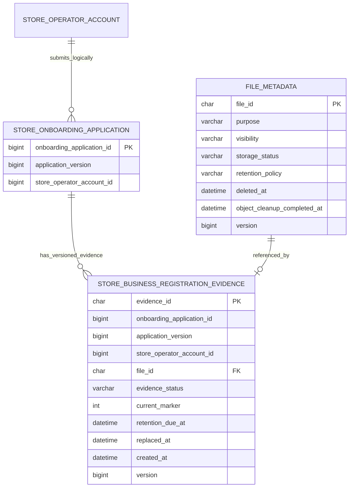

# 사업자등록증 비공개 증빙 ERD

## 범위

이 문서는 #344의 비공개 사업자등록증 증빙 원장과 공통 파일 메타데이터의 물리 관계를 설명한다. 신청·심사 사건·심사자 배정 테이블은 #277 소유의 후속 범위이므로, 현재는 신청 식별자와의 논리 연결만 표시한다.

원본 URL, 객체 키, 파일 원문, 사업자등록번호, 대표자명은 ERD와 공개 DTO에 포함하지 않는다.

## 물리 제약

| 대상 | 제약 | 의미 |
| --- | --- | --- |
| `store_business_registration_evidences.file_id` | FK → `file_metadata.file_id`, UNIQUE | 하나의 비공개 파일은 증빙 원장 한 건에만 연결한다. |
| `(onboarding_application_id, application_version, current_marker)` | UNIQUE | 같은 신청 version에서 `current_marker=1`인 CURRENT 증빙은 정확히 하나만 허용한다. 교체 이력은 `NULL`로 보관한다. |
| `evidence_status`와 `current_marker` | CHECK | `CURRENT`는 marker `1`과 보존 기한 없음, `REPLACED`는 marker `NULL`과 보존 기한·교체 시각을 반드시 가진다. |
| `file_metadata` 삭제 | locking current read | CURRENT 증빙이 참조하는 파일은 삭제할 수 없다. `REPEATABLE READ` 스냅샷을 만든 트랜잭션도 최신 CURRENT 행을 잠가 다시 확인한다. |

## 상태 관계

1. private·confirmed `file_metadata`만 새 CURRENT 증빙으로 연결한다.
2. 교체 시 기존 CURRENT를 먼저 `REPLACED`로 전환하고 7일 보존 기한을 기록한 뒤, 새 CURRENT를 저장한다.
3. CURRENT 증빙이 참조하는 파일은 공통 파일 삭제 경로가 거절한다.
4. 실제 S3 업로드, 심사자 열람 권한, 보존 만료 삭제 worker와 신청·심사 테이블은 후속 PR 범위다.

## 구현 경계

- 물리 테이블: `file_metadata`, `store_business_registration_evidences`
- 논리 식별자만 보관: `onboarding_application_id`, `application_version`, `store_operator_account_id`
- 후속 #277은 `StoreBusinessRegistrationEvidenceService`와 URL 없는 DTO만 사용하며, `FileMetadata` Entity/Repository를 직접 참조하지 않는다.
