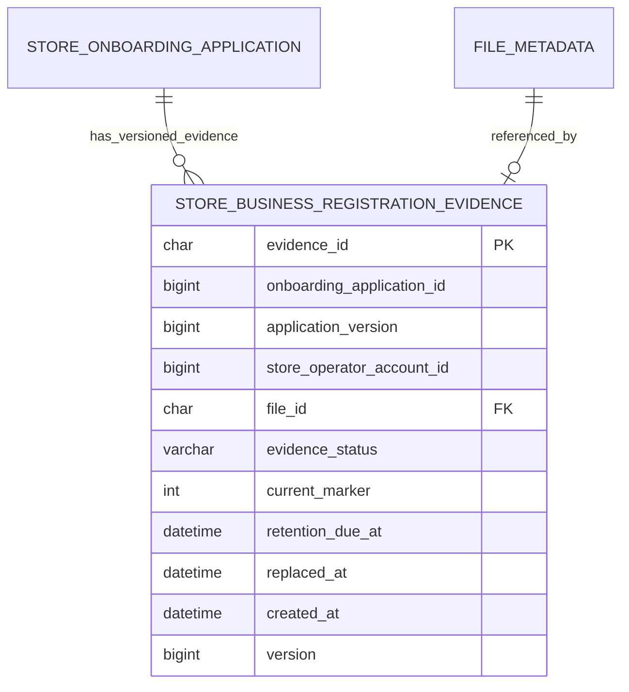

# Store Onboarding Evidence Contract

## Purpose

사업자등록증은 공개 매장·메뉴 이미지와 분리한 비공개 증빙이다. 이 정본은 #344의 Store 공개 Service/DTO와 #277 심사 workflow 사이의 최소 경계를 정의한다.

신청·심사 workflow 테이블은 #277의 소유 범위이므로, 현재 원장과의 연결은 논리 관계로만 표시한다.

## Public Service Contract

- 신청 식별자는 양의 정수 `onboardingApplicationId`, 신청 자료 version은 양의 정수 `applicationVersion`이다.
- #277이 `StoreOnboardingApplicationOwnershipPort`를 구현해 신청·자료 version·매장 운영자 계정의 소유 일치를 먼저 검증해야 한다. 구현 전 기본 port는 증빙 연결을 `503`으로 거절한다.
- `StoreBusinessRegistrationEvidenceService.replaceCurrentEvidence`는 private·confirmed `BUSINESS_LICENSE` 파일만 받는다.
- 반환 DTO는 `evidenceId`, `applicationVersion`, 상태, 현재 여부, 보존 예정 시각만 포함한다.
- `fileId`, 객체 키, URL, 파일 원문, 사업자등록번호, 대표자명은 반환하지 않는다.
- #277은 이 Service와 DTO만 호출하며 FileMetadata, Store, Auth Entity/Repository를 직접 참조하지 않는다.

## State Boundary

- 같은 신청 version의 현재 증빙은 하나다. DB 유니크 키는 현재 행만 `current_marker=1`, 교체 이력은 `NULL`로 보관한다.
- 파일 메타데이터는 `PESSIMISTIC_WRITE`로 잠근 뒤 상태를 검증하므로, `DELETED` 전이와 새 CURRENT 증빙 연결이 동시에 확정되지 않는다.
- 새 증빙이 확정되면 기존 증빙은 즉시 `REPLACED`가 되어 접근 대상에서 제외되고, 7일 뒤 보존 기한을 가진다.
- 이번 PR은 증빙 원장만 만든다. 실제 private S3 업로드, 심사자 재인증 열람, 보존 만료 삭제 worker는 별도 PR에서 구현한다.

## Data Model

| 대상 | 제약 | 의미 |
| --- | --- | --- |
| `store_business_registration_evidences.file_id` | FK -> `file_metadata.file_id`, UNIQUE | 하나의 비공개 파일은 증빙 원장 한 건에만 연결한다. |
| `(onboarding_application_id, application_version, current_marker)` | UNIQUE | 같은 신청 version의 CURRENT 증빙은 하나만 허용하고 교체 이력은 `NULL`로 보관한다. |
| `evidence_status`와 `current_marker` | CHECK | `CURRENT`는 marker `1`과 보존 기한 없음, `REPLACED`는 marker `NULL`과 보존 기한·교체 시각을 가진다. |
| 공통 파일 삭제 | locking current read | CURRENT와 REPLACED 증빙이 참조하는 파일은 일반 삭제하지 않는다. 보존 기한·분쟁 예외·실제 객체 삭제는 후속 전용 파기 worker만 판단한다. |

## Runtime Boundary

- `miriyum.storage.s3.enabled`는 false를 유지한다.
- 실제 private bucket·IAM·환경값·staging smoke가 끝나기 전에는 이 계약의 runtime endpoint를 노출하지 않는다.
