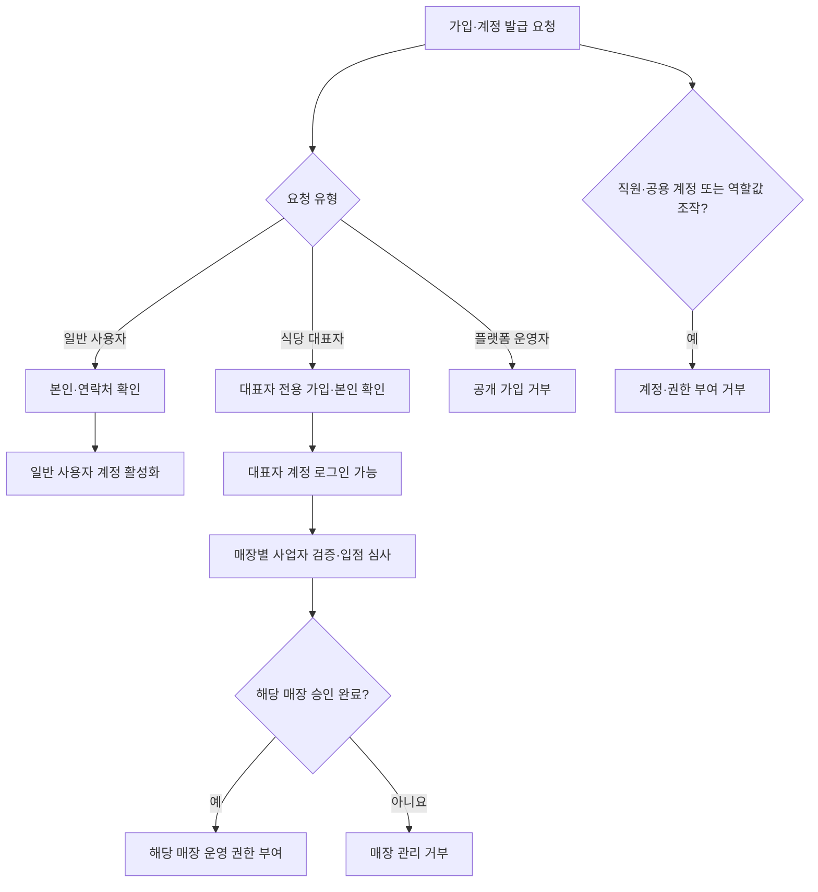
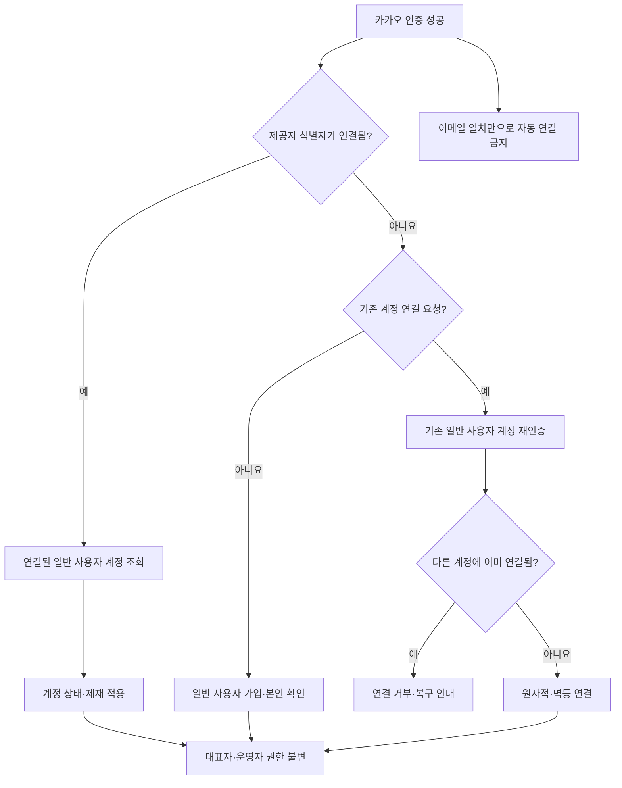
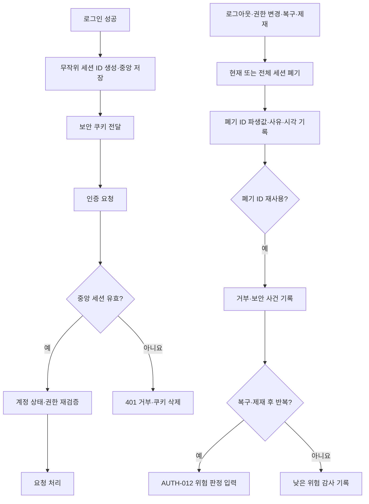

# 인증·인가 정책 보완 설계

> 작성일: 2026-07-22
> 기준 브랜치: `origin/main` (`c84dd38`)
> 구현 대상: `docs/service-policies/01-member-auth.md`

## 1. 목적

MiriYum의 기존 중앙 서버 세션 구조를 유지하면서 계정 유형, 식당 대표자 권한, 카카오 계정 연결, 세션 폐기와 재사용 대응을 모호하지 않게 정리한다. 문서 중복과 용어·문장 오류도 함께 바로잡되 이미 확정된 인증 방식과 세션 만료 수치는 변경하지 않는다.

## 2. 범위

직접 수정하는 정책 파일은 `docs/service-policies/01-member-auth.md` 하나다. `docs/technical-architecture.md`는 Spring Security, Spring Session Data Redis, Valkey 중앙 세션, 브라우저 JWT 미사용이라는 구조를 대조하는 기준으로만 사용한다.

이번 변경은 다음을 포함한다.

- 일반 사용자·식당 대표자·플랫폼 운영자의 독립된 인증 경계
- 직원·공용 계정 미지원과 식당 대표자 전용 매장 운영
- 일반 사용자나 카카오 계정 연결을 통한 권한 자가 승격 차단
- 식당 대표자 로그인 상태와 매장별 운영 권한의 분리
- 카카오 제공자 식별자와 기존 일반 사용자 계정의 안전한 연결
- 중앙 세션의 생성·교체·만료·폐기·로그아웃
- 폐기된 세션 ID의 재사용 거부·감사·위험 판정 연계
- 중복된 `AUTH-006 연계` 하위 블록 정리와 용어·오탈자 교정

다음은 이번 변경에서 제외한다.

- 매장 입점·사업자등록증 업로드·매장 정보·운영시간 정책 변경
- 개별 테이블·좌석·예약 수용량 정책 변경
- 관리자 운영·결제 승인·감사 보관기간 정책 변경
- `docs/technical-architecture.md`와 다른 서비스 정책 파일 수정
- 별도 검수 보고서 파일 작성

검증 결과는 작업 대화와 pull request 설명에 기록한다.

## 3. 용어와 불변식

- 문서의 운영 주체 용어는 `식당 대표자`로 통일한다.
- 식당 대표자는 사업자등록증상 대표자 본인이다.
- 매장 직원용 계정과 매장·법인 명의 공용 계정은 지원하지 않는다.
- 일반 사용자, 식당 대표자, 플랫폼 운영자는 서로 다른 계정 유형이다.
- 같은 사람이 여러 계정 유형을 보유할 수 있어도 인증 상태와 권한은 자동 공유·승격되지 않는다.
- 공개 요청의 역할 값, 카카오 로그인, 로그인 수단 연결로 계정 유형을 변경할 수 없다.
- 플랫폼 운영자는 공개 가입할 수 없으며 별도 관리자 발급 정책을 따른다.
- 브라우저 인증은 중앙 서버 세션을 사용하고 Access·Refresh JWT를 사용하지 않는다.

## 4. 계정과 식당 대표자 권한

식당 대표자 가입·본인 확인과 특정 매장의 운영 권한을 분리한다. 대표자 계정이 로그인 가능한 상태여도 해당 매장의 사업자 검증과 입점 승인이 완료되지 않았다면 매장 관리 요청을 허용하지 않는다. 모든 매장 관리 요청은 중앙 계정 유형, 현재 계정 상태, 매장 소속 관계, 매장별 승인 상태를 다시 검증한다.

## 5. 카카오 로그인과 계정 연결

카카오 로그인은 일반 사용자에게만 제공하며 식당 대표자나 플랫폼 운영자 권한을 만들거나 변경하지 않는다. 카카오 제공자 식별자가 이미 연결되어 있으면 연결된 일반 사용자 계정의 현재 상태와 제재를 적용한다.

연결되지 않은 카카오 식별자를 기존 계정에 추가하려면 기존 일반 사용자 계정의 본인 인증을 먼저 완료해야 한다. 이메일 주소가 같다는 추정만으로 자동 연결하지 않는다. 제공자 식별자가 다른 계정에 연결되어 있으면 연결·이동·병합을 모두 중단하고 계정 복구 경로를 안내한다. 제공자와 제공자 식별자의 중앙 유일성 제약, 연결 요청 식별자와 멱등 처리를 사용해 중복·역순 콜백에도 하나의 연결만 확정한다.

## 6. 중앙 세션 생명주기와 재사용 대응

기존 유휴·절대 만료시간과 동시 세션 상한은 유지한다. 로그인, 권한 변경과 추가 인증 성공 시 새 무작위 세션 ID를 발급하고 이전 ID를 즉시 무효화한다. 로그아웃은 중앙 세션 무효화와 브라우저 쿠키 삭제를 함께 수행하며 이미 만료·폐기된 세션으로 반복 요청해도 안전하게 같은 종료 결과로 수렴한다.

비밀번호 분실 재설정, 수동 복구, 탈퇴, 제재와 보안 잠금처럼 모든 기존 세션을 철회해야 하는 사건은 중앙 계정 세션 버전과 세션 인덱스를 갱신한다. 모든 애플리케이션 인스턴스는 중앙 상태를 확인하고 철회 전 세션을 거부한다.

폐기되거나 교체된 세션 ID가 다시 제시되면 인증을 거부하고 쿠키를 삭제한다. 세션 원문을 로그나 감사에 저장하지 않고 서버 비밀키 기반 파생 식별값, 폐기 사유, 폐기 시각과 재사용 시각만 보안 사건에 기록한다. 일반적인 세션 교체 직후의 단발성 오래된 요청은 계정을 자동 잠그지 않는다. 계정 복구·제재·전체 세션 철회 뒤 폐기 ID가 반복 사용되면 `AUTH-012`의 위험 판정 입력으로 연결한다.

## 7. 실패 처리

- 중앙 세션 저장소를 조회·갱신할 수 없으면 신규 로그인과 인증 필수 요청을 실패 폐쇄하고 비회원 공개 조회만 유지한다.
- 권한 없는 매장 관리 요청은 거부하되 다른 계정·매장 귀속 정보와 내부 승인 상태를 불필요하게 노출하지 않는다.
- 카카오 콜백이 중복되거나 순서가 바뀌어도 계정과 연결 관계를 중복 생성하지 않는다.
- 다른 계정에 연결된 카카오 식별자는 관리자 재량으로 즉시 이동·병합하지 않는다.
- 이미 폐기된 세션에 대한 로그아웃도 중앙 상태를 되살리지 않고 쿠키를 삭제한다.
- 세션 폐기·보안 사건 기록 또는 알림의 일부 후속 처리가 실패해도 폐기된 세션을 다시 유효하게 만들지 않는다.
- 단발성 폐기 ID 요청은 즉시 계정 잠금으로 승격하지 않고 반복성·선행 보안 사건과 함께 판정한다.

## 8. 문서 편집 원칙

- `AUTH-001`에는 계정 유형과 매장별 권한 부여 경계를 명시한다.
- `AUTH-005`에는 카카오 제공자 식별자의 유일성, 기존 계정 재인증, 추정 기반 자동 연결 금지를 명시한다.
- `AUTH-007`에는 로그아웃 멱등성, 폐기 세션 재사용 거부·감사·위험 연계를 명시한다.
- `AUTH-012`에는 고신뢰 재사용 사건이 위험 판정 입력이라는 연결을 명시한다.
- 중복된 `AUTH-006 연계`, 후속 항목과 결정 기록 블록은 의미가 같은 하나의 블록으로 정리한다.
- `매장 대표자`와 `식당 대표자`는 `식당 대표자`로 통일한다.
- 오탈자와 미완성 문장을 고치되 세션 만료시간, 동시 세션 상한과 기존 정책 상태는 바꾸지 않는다.

## 9. 검증과 인수 조건

다음 조건을 모두 만족해야 한다.

- 직원·공용 계정을 허용하는 현재 정책 문장이 없다.
- 일반 사용자 요청, 공개 역할 값과 카카오 연결로 식당 대표자·플랫폼 운영자 권한을 얻을 수 없다.
- 식당 대표자 로그인만으로 특정 매장 운영 권한이 생기지 않으며 매장별 검증·승인 관계가 필요하다.
- 이메일 일치만으로 카카오 연결이 자동 확정되지 않고 이미 연결된 제공자 식별자는 다른 계정으로 이동하지 않는다.
- 권한 변경·복구·탈퇴·제재 뒤 기존 세션이 모든 인스턴스에서 거부된다.
- 로그아웃·세션 폐기가 멱등하고 폐기 ID 재사용은 인증 거부·감사·위험 판정 경계와 연결된다.
- 중앙 세션 장애가 과거 권한이나 로컬 상태를 근거로 인증을 허용하지 않는다.
- 중복된 `AUTH-006 연계` 하위 블록이 하나로 정리된다.
- 계정 유형, 정책 ID, 정책 상태와 결정 기록 사이에 모순이 없다.
- `docs/technical-architecture.md`의 중앙 서버 세션·브라우저 JWT 미사용 구조와 일치한다.
- 정책 본문 변경은 `docs/service-policies/01-member-auth.md`로 제한된다.
- `git diff --check`가 성공한다.

## 10. 검증 방법

문서 수정 후 다음을 수행한다.

1. `git diff --check`로 공백·패치 오류를 확인한다.
2. `git diff --name-only origin/main...HEAD`로 정책 본문 변경 범위를 확인한다.
3. `rg -n "직원|공용 계정|역할|승격|카카오|세션|JWT|로그아웃|재사용|AUTH-006" docs/service-policies/01-member-auth.md`로 핵심 정책과 중복을 점검한다.
4. 제목·정책 상태·결정 기록을 육안 대조하여 중복·모순·미완성 문장이 없는지 확인한다.
5. `docs/technical-architecture.md`의 인증 섹션과 대조하여 중앙 세션·JWT 미사용·실패 폐쇄 원칙이 일치하는지 확인한다.

## 11. 승인된 결정

- 기존 중앙 서버 세션 구조를 유지한다.
- 매장 운영은 사업자등록증상 식당 대표자 본인만 수행한다.
- 직원 계정과 공용 계정은 지원하지 않는다.
- 수정 대상 정책 파일은 `01-member-auth.md` 하나로 제한한다.
- 검증 결과는 대화와 pull request에 기록하고 별도 검수 보고서 파일은 만들지 않는다.
- 위 계정·카카오 연결·중앙 세션·실패 처리 흐름은 2026-07-22 대화에서 사용자 승인을 받았다.
