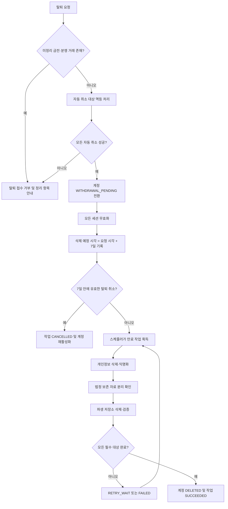
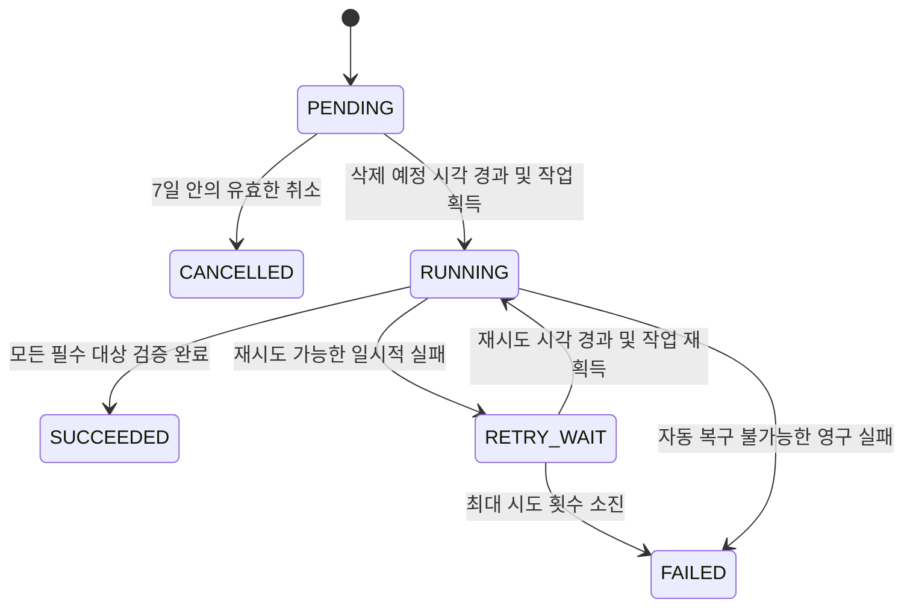

# MiriYum 개인정보 삭제 처리 구현 계획

> **에이전트 작업자용:** 이 계획을 실제 코드로 구현할 때는 `superpowers:subagent-driven-development` 또는 `superpowers:executing-plans`를 사용해 작업 단위로 실행한다.

**목표:** 탈퇴 요청부터 7일 유예, 최종 개인정보 삭제·익명화, 법정 자료 분리, 실패 재처리와 백업 복원까지 멱등하고 추적 가능한 처리 기준을 정의한다.

**아키텍처:** MySQL을 계정 상태와 삭제 작업의 내구성 원본으로 사용하고 Spring 스케줄러가 DB 조건부 선점으로 만료 작업을 획득한다. 개인정보는 7일 유예 후 원문 삭제 또는 복구 불가능한 익명화를 수행하며, 실제 파생 저장소가 두 개 이상일 때만 대상별 체크포인트를 추가한다.

**기술 기준:** Java 21, Spring Boot, Spring MVC, Spring Data JPA, MySQL, Flyway를 기본으로 하며 Kafka·Valkey·OpenSearch는 프로젝트에 실제 도입된 경우에만 연동한다.

> 문서 상태: 구현 전 계획
> 작성일: 2026-07-23
> 적용 범위: 일반 사용자·가게 대표자·운영자 계정의 탈퇴 및 개인정보 삭제 전파
> 정책 정본: `AUTH-010`, `PRIV-005`, `PRIV-006`, `PRIV-013`, `SCALE-009`, `SCALE-010`

## 전역 제약

- 개인정보 삭제만을 위해 Kafka, Quartz 또는 Redis·Valkey 분산 락을 새로 도입하지 않는다.
- 개인정보 원문을 멱등 키, 삭제 원장, 작업 로그, 지표 또는 추적 정보에 기록하지 않는다.
- 데이터별 법정 보존 항목과 기간을 최종 법률 검토 없이 임의로 확정하지 않는다.
- 저장소에 애플리케이션 구조가 생성되기 전에는 패키지·클래스·마이그레이션 경로를 임의로 고정하지 않는다.

## 1. 목적

이 문서는 MiriYum의 탈퇴 및 개인정보 삭제 처리를 담당하는 팀원이 동일한 기준으로 설계·구현·검증할 수 있도록 구현 범위를 정리한다.

이 문서는 새로운 개인정보 정책을 확정하지 않는다. 정책 내용이 충돌하면 다음 정본을 우선한다.

- [회원·인증·계정 정책](../../service-policies/01-member-auth.md)의 `AUTH-010`
- [개인정보·보안 정책](../../service-policies/17-privacy-security.md)의 `PRIV-005`, `PRIV-006`, `PRIV-013`
- [대규모 트래픽·분산 환경·장애 복구 정책](../../service-policies/18-scale-reliability.md)의 `SCALE-009`, `SCALE-010`
- [공식 기술 방향](../../06-system-architecture.md)

## 2. 세 줄 요약

1. 탈퇴 요청 후 7일 동안은 `WITHDRAWAL_PENDING` 상태로 접근을 차단하되, 재인증을 통한 탈퇴 취소를 위해 필요한 정보를 제한적으로 유지한다.
2. 7일이 지나면 개인정보가 남은 단순 소프트 삭제로 끝내지 않고, 개인정보를 물리 삭제하거나 복구 불가능하게 익명화한다.
3. MySQL 삭제 원장, 멱등 키, 최소 스케줄러를 기본으로 사용하고 체크포인트·Kafka 연동은 실제 저장소와 인프라가 도입된 범위까지만 확장한다.

## 3. 핵심 결정

### 3.1 필수 범위

- 탈퇴 요청의 멱등 처리
- 요청 즉시 계정 접근 차단 및 전체 세션 종료
- 7일 유예기간과 삭제 예정 시각의 내구성 있는 기록
- 유예기간 안의 재인증 기반 탈퇴 취소
- 유예기간 만료 후 최종 삭제·익명화
- 삭제 작업 상태와 실패 원인의 추적
- 일시적 실패의 제한 재시도
- 여러 인스턴스의 중복 실행 방지
- 법정 보존 자료와 일반 계정정보의 분리
- 백업 복원 시 삭제 원장의 재적용

### 3.2 이번 계획에서 제외하는 범위

- 개인정보 삭제만을 위한 Kafka 신규 도입
- Quartz 신규 도입
- Redis·Valkey 기반 분산 락 신규 도입
- 존재하지 않는 검색·캐시·분석 저장소를 가정한 체크포인트 구현
- `PRIV-005`, `PRIV-006`에서 확정되지 않은 법정 보존 항목·기간의 임의 결정
- 실제 애플리케이션 구조가 생성되기 전 패키지·클래스·마이그레이션 파일 경로의 확정

## 4. 전체 처리 흐름



## 5. 소프트 삭제와 최종 파기의 경계

### 5.1 7일 유예기간

탈퇴 요청 직후에는 계정을 `WITHDRAWAL_PENDING`으로 전환한다. 이 단계는 탈퇴 취소를 지원하기 위한 제한적 소프트 삭제 단계다.

다음 조건을 모두 만족해야 한다.

- 로그인과 인증이 필요한 모든 서비스 이용을 즉시 차단한다.
- 모든 활성 세션을 무효화한다.
- 탈퇴 요청 시각과 삭제 예정 시각을 중앙 MySQL 상태에 기록한다.
- 취소는 삭제 예정 시각 전 유효한 재인증을 통과한 계정 소유자에게만 허용한다.
- 탈퇴 대기 정보와 개인정보를 추천·광고·마케팅·분석의 신규 입력으로 사용하지 않는다.

### 5.2 7일 경과 후

최종 삭제 시점 이후에는 `deleted_at`만 기록하고 이름·이메일·전화번호 같은 개인정보를 그대로 남기는 방식을 허용하지 않는다.

관계 무결성을 위해 회원 행을 남겨야 한다면 다음과 같이 개인정보가 제거된 tombstone으로 전환한다.

| 항목 | 최종 처리 |
|---|---|
| 내부 회원 ID | 참조 무결성에 필요한 경우에만 유지 |
| 계정 상태 | `DELETED` |
| 이름·닉네임 | `NULL` 또는 공통 표시값 `탈퇴 회원` |
| 이메일·휴대전화 | 원문 삭제 |
| 비밀번호·인증 비밀 | 삭제 또는 복구 불가능한 무효화 |
| 외부 로그인 식별자 | 삭제 |
| 프로필 이미지 | 객체 저장소와 파생 썸네일에서 삭제 |
| 위치·취향·알레르기 연결 정보 | 삭제 또는 복구 불가능한 익명화 |
| 삭제 완료 시각 | 유지 |

내부 회원 ID가 다른 정보와 결합되어 개인을 다시 식별할 수 있다면 일반 서비스 영역에서 자유롭게 조회하거나 결합하지 않는다.

### 5.3 법정 보존 자료

결제·계약·환불·분쟁 등 별도 법령에 따라 보존해야 하는 자료는 다음 원칙으로 관리한다.

- 활성 회원정보와 별도 테이블·스키마 또는 별도 접근 경계로 분리한다.
- 법정 목적에 필요한 최소 항목만 보관한다.
- 로그인·프로필 복구·추천·광고·마케팅 목적으로 사용하지 않는다.
- 권한 있는 담당자만 사건 또는 업무 목적에 결속하여 조회한다.
- 조회·내보내기·파기 이력을 감사한다.
- 보존기간이 끝나면 별도 만료 작업으로 파기한다.

정확한 항목과 보존기간은 `PRIV-005`, `PRIV-006`의 최종 법률 검토 결과를 따른다.

### 5.4 재가입 제한 토큰

재가입 제한을 위해 원본 이메일·휴대전화·외부 로그인 식별자를 보관하지 않는다.

- 정규화된 식별값으로 서버 비밀키 기반 토큰을 생성한다.
- 토큰에는 계정 유형, 제한 종류, 만료 시각만 최소 연결한다.
- 일반 회원 프로필과 분리한다.
- 제한 만료 후 삭제한다.
- 내부에서 개인 판별에 사용할 수 있으므로 보호 대상 정보로 취급한다.
- 단순 해시만으로 원문 보관을 대체하지 않는다.

## 6. 논리 데이터 모델

### 6.1 삭제 작업 원장

`deletion_job`은 삭제 요청과 최종 처리 상태의 내구성 있는 원본이다.

| 필드 | 역할 |
|---|---|
| `id` | 내부 삭제 작업 ID |
| `subject_internal_id` | 원문 식별정보가 아닌 내부 대상 ID |
| `request_idempotency_key` | 동일 탈퇴 요청의 중복 생성 방지 |
| `status` | 작업 상태 |
| `requested_at` | 탈퇴 요청 시각 |
| `scheduled_at` | 최종 삭제 예정 시각 |
| `started_at` | 최근 실행 시작 시각 |
| `completed_at` | 최종 완료 시각 |
| `attempt_count` | 실행 시도 횟수 |
| `next_retry_at` | 다음 재시도 가능 시각 |
| `lease_until` | 현재 작업자의 임대 만료 시각 |
| `last_error_code` | 개인정보 원문이 없는 분류형 오류 코드 |
| `policy_version` | 적용된 삭제·보존 정책 버전 |

원장에 이름·닉네임·이메일·휴대전화·외부 로그인 ID·주소·결제수단 원문을 저장하지 않는다.

### 6.2 저장소별 체크포인트

두 개 이상의 실제 삭제 대상이 존재할 때만 `deletion_job_step`을 도입한다.

| 필드 | 역할 |
|---|---|
| `id` | 단계 ID |
| `deletion_job_id` | 삭제 작업 참조 |
| `target_type` | 실제 대상 저장소 또는 데이터 범주 |
| `status` | 대상별 처리 상태 |
| `attempt_count` | 대상별 시도 횟수 |
| `next_retry_at` | 대상별 다음 재시도 시각 |
| `completed_at` | 대상별 완료 시각 |
| `last_error_code` | 개인정보 원문이 없는 오류 코드 |
| `target_version` | 역순·오래된 작업 차단용 버전 |

필수 제약은 다음과 같다.

- `deletion_job.request_idempotency_key`는 요청 범위 안에서 유일해야 한다.
- 동일 대상에 활성 탈퇴 작업이 둘 이상 생성되지 않아야 한다.
- `(deletion_job_id, target_type)`은 유일해야 한다.
- 이미 완료된 단계는 같은 버전의 재실행으로 다시 변경되지 않아야 한다.

## 7. 상태 전이

작업 상태는 다음 여섯 개를 기본으로 사용한다.

```text
PENDING
RUNNING
RETRY_WAIT
SUCCEEDED
FAILED
CANCELLED
```

허용 상태 전이는 다음과 같다.



`SUCCEEDED`, `FAILED`, `CANCELLED` 상태에서 이전 상태로 임의 전환하지 않는다. 수동 재처리는 기존 상태를 덮어쓰지 않고 별도 재처리 사건과 감사 이력을 만든다.

## 8. 멱등성

### 8.1 API 요청

- 동일 사용자·동일 탈퇴 작업의 같은 멱등 키는 기존 작업을 반환한다.
- 같은 키에 다른 요청 내용이 들어오면 충돌로 거부한다.
- 중복 클릭이나 네트워크 재시도로 새 삭제 작업·감사 이력·자동 취소 명령을 중복 생성하지 않는다.

### 8.2 스케줄 작업

- 여러 작업자가 같은 삭제 작업을 조회해도 조건부 상태 변경에 성공한 하나의 작업자만 실행한다.
- 임대를 잃은 작업자는 결과 게시와 완료 전환을 중단한다.
- 작업을 반복 실행해도 동일한 최종 상태를 만든다.

### 8.3 대상별 삭제

- 삭제·익명화 명령은 `deletion_job_id`, `target_type`, `target_version`으로 중복 효과를 방지한다.
- 이미 존재하지 않는 데이터를 삭제하는 결과도 성공으로 수렴할 수 있어야 한다.
- 집계 데이터는 같은 삭제 사건으로 중복 감소하지 않아야 한다.

### 8.4 Kafka 사용 시

Kafka가 실제 도입된 경우에만 다음을 추가한다.

- MySQL 업무 상태와 Outbox를 같은 트랜잭션에 기록한다.
- 이벤트에 사건 ID, 대상 유형·ID·버전, 정책 버전을 포함한다.
- 소비자 이름과 사건 ID의 Inbox 유일 제약으로 중복 효과를 방지한다.
- 실제 대상 반영과 Inbox 기록 후에만 소비 완료 체크포인트를 전진한다.
- Kafka 발행 성공만으로 개인정보 삭제 완료를 판정하지 않는다.

## 9. 스케줄러

최소 구현은 Spring `@Scheduled`와 MySQL 기반 조건부 선점을 사용한다.

스케줄러는 다음 작업을 담당한다.

- `scheduled_at`이 지난 `PENDING` 작업의 획득
- `next_retry_at`이 지난 `RETRY_WAIT` 작업의 재획득
- 법정 보존기간이 끝난 격리 자료의 파기
- 만료된 재가입 제한 토큰의 삭제
- 오래된 `RUNNING` 작업의 임대 만료 확인과 안전한 재처리

다중 인스턴스 환경에서는 로컬 메모리 플래그나 특정 서버 고정 실행에 의존하지 않는다. 중앙 DB의 조건부 갱신, 임대 만료 시각과 서버 기준 시각으로 소유권을 판단한다.

## 10. 탈퇴 취소와 삭제 실행의 경합

탈퇴 취소는 다음 조건을 하나의 원자적 처리 경계에서 검증한다.

- 계정 상태가 `WITHDRAWAL_PENDING`이다.
- 현재 시각이 `scheduled_at`보다 이르다.
- 삭제 작업 상태가 아직 `PENDING`이다.
- 재인증 결과가 유효하다.

조건을 만족하면 계정을 활성 상태로 복구하고 작업을 `CANCELLED`로 전환한다. 삭제 작업 획득이 먼저 확정되어 `RUNNING`이 됐거나 삭제 예정 시각이 지났다면 취소를 거부한다.

## 11. 실패와 재시도

실패를 다음과 같이 구분한다.

| 분류 | 예시 | 처리 |
|---|---|---|
| 일시적 실패 | DB 교착, 검색 저장소 일시 장애, 네트워크 시간 초과 | 제한 재시도 후 수렴 |
| 영구 실패 | 잘못된 정책 버전, 알 수 없는 대상 유형, 스키마 불일치 | 즉시 격리 또는 `FAILED` |
| 권한 실패 | 삭제 키·저장소 접근 권한 거부 | 실패 폐쇄, 운영자·보안 경보 |
| 결과 불명 | 외부 효과 응답 유실 | 같은 멱등 키로 상태 조회·재확인 |

재시도는 무한 반복하지 않는다. 최대 시도 횟수를 소진한 작업은 `FAILED`로 유지하고 권한 있는 운영자의 수동 재처리 대상으로 남긴다.

로그와 오류 필드에는 개인정보 원문을 넣지 않는다. `last_error_code`에는 허용된 오류 분류만 기록하고 상세 원인은 접근이 통제된 운영 사건에 연결한다.

## 12. 백업과 복원

탈퇴할 때마다 기존 시점 백업 파일을 수정하지는 않는다. 대신 다음을 보장한다.

- 백업은 일반 서비스·분석 조회에서 격리한다.
- 삭제 원장은 운영 데이터와 독립적으로 복구 가능해야 한다.
- 복원 환경에서 백업 생성 이후의 삭제·권한 회수·키 변경 사건을 먼저 재적용한다.
- 삭제 재적용과 무결성 검증이 끝나기 전 운영 트래픽에 연결하지 않는다.
- 검색·캐시·분석·파일 파생물을 재구축할 때도 삭제 체크포인트를 적용한다.
- 복원 후 삭제된 개인정보가 다시 노출되면 복원을 실패 처리한다.

## 13. MVP 구현 범위

### 13.1 반드시 구현

- MySQL 기반 `deletion_job`
- 동일 탈퇴 요청 및 동일 활성 작업의 DB 유일 제약
- `WITHDRAWAL_PENDING`과 `DELETED` 계정 상태
- 요청 시각과 7일 후 삭제 예정 시각
- 전체 세션 무효화
- 원자적인 탈퇴 취소
- Spring `@Scheduled` 기반 만료 작업 조회
- DB 조건부 획득과 작업 임대
- 개인정보 삭제 또는 복구 불가능한 익명화
- 법정 보존 자료의 일반 계정정보 분리
- 제한된 자동 재시도와 최종 실패 상태
- 개인정보를 포함하지 않는 감사·관측 정보

### 13.2 실제 의존성이 생길 때 확장

- OpenSearch·Valkey·객체 저장소·분석 저장소별 `deletion_job_step`
- Kafka Outbox·Inbox
- 별도 worker 배포
- 대량 삭제 파티션 임대와 fencing
- 자동 백업 복원 환경에서의 삭제 원장 재적용

### 13.3 외부 결정 후 반영

- 데이터 항목별 완전 삭제·익명화·법정 보존 매트릭스
- 계약·결제·분쟁 자료의 정확한 법정 보존 범위와 기간
- 개인정보 처리방침의 탈퇴·삭제·보존 고지 문구
- 제재 계정 재가입 제한 토큰의 최종 법률 검토

## 14. 관측 가능한 인수 조건

- [ ] 같은 탈퇴 요청을 반복해도 활성 삭제 작업은 하나만 생성된다.
- [ ] 같은 멱등 키에 다른 요청 내용을 보내면 충돌로 거부된다.
- [ ] 탈퇴 요청 즉시 모든 기존 세션과 인증 필수 기능 접근이 차단된다.
- [ ] 7일 안에 정상 취소된 계정은 삭제되지 않는다.
- [ ] 취소와 삭제 작업 획득을 동시에 실행해도 유효한 최종 상태 하나만 남는다.
- [ ] 여러 스케줄러 인스턴스가 같은 작업을 조회해도 최종 삭제 효과가 중복되지 않는다.
- [ ] 7일 경과 후 개인정보가 남은 단순 소프트 삭제 상태로 종료되지 않는다.
- [ ] 최종 삭제 후 이메일·휴대전화·외부 로그인 ID·프로필 이미지 원문이 일반 서비스 저장소에 남지 않는다.
- [ ] 법정 보존 자료는 일반 계정정보와 분리되며 로그인·프로필 복원에 사용되지 않는다.
- [ ] 일부 저장소가 실패하면 전체 작업을 성공으로 표시하지 않는다.
- [ ] 재시도 시 이미 성공한 대상과 집계 결과가 중복 변경되지 않는다.
- [ ] 최대 재시도 횟수 소진 후 작업이 `FAILED`로 남고 수동 재처리 근거가 기록된다.
- [ ] 삭제 원장·멱등 키·로그·지표에 개인정보 원문이 포함되지 않는다.
- [ ] 만료된 재가입 제한 토큰과 법정 보존 자료가 예정된 파기 작업으로 삭제된다.
- [ ] 삭제 전 백업을 복원해도 삭제 원장 재적용 전에는 운영 연결이 차단된다.
- [ ] 복원·재색인·재집계 후 삭제된 개인정보가 검색·캐시·분석 결과에 나타나지 않는다.

## 15. 법적 기준 참고

이 절은 구현 참고이며 최종 법률 자문을 대체하지 않는다.

- [개인정보 보호법 제21조](https://law.go.kr/lsLinkCommonInfo.do?chrClsCd=010202&lsJoLnkSeq=1029335625): 처리 목적이 끝나 불필요해진 개인정보의 파기, 복구·재생 방지, 법정 보존 자료의 분리
- [개인정보 보호법 시행령 제16조](https://law.go.kr/LSW/lsLinkCommonInfo.do?chrClsCd=010202&lspttninfSeq=67043): 전자적 파일의 복원이 불가능한 영구 삭제 원칙
- [전자상거래법 시행령 제6조](https://law.go.kr/LSW/lsLinkCommonInfo.do?chrClsCd=010202&lspttninfSeq=63460): 거래기록 종류별 보존과 동의 철회 사용자 기록의 별도 보존

## 16. 담당자 실행 지시문

다음 문장을 담당 팀원 또는 AI 작업자에게 전달할 수 있다.

> 이 계획과 연결된 정책 정본을 먼저 확인한 뒤 개인정보 삭제 기능을 구현해 주세요. 7일 동안은 `WITHDRAWAL_PENDING`으로 접근을 차단하고 취소를 허용하되, 7일 경과 후에는 개인정보가 남은 소프트 삭제로 끝내지 말고 원문 삭제 또는 복구 불가능한 익명화를 수행해야 합니다. MySQL 삭제 원장·DB 유일 제약·Spring `@Scheduled`·DB 조건부 선점을 기본으로 사용하고, 체크포인트와 Kafka는 실제 저장소·인프라가 존재할 때만 추가하세요. 법정 보존 항목과 기간은 `PRIV-005`, `PRIV-006`의 확정 결과 없이 임의로 결정하지 마세요. 구현 후 변경 파일, 상태 전이, 멱등·동시성 방식, 삭제·익명화·법정 보존 구분, 테스트 결과와 후속 범위를 보고해 주세요.
